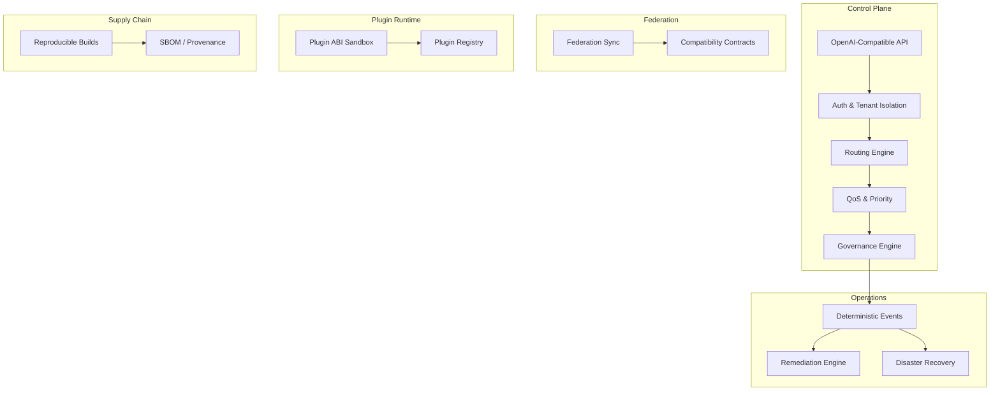

# LLM Inference Stack & Agentic AI Platform

**Sovereign, offline-first, deterministic AI platform — multi-tenant, multi-provider, white-label ready.**

> Current build: `v2.0.0-agentic-platform`  
> Previous stable: [`v1.10.0-agentic-runtime`](releases/v1.10.0-agentic-runtime)  
> Release notes: [`docs/releases/V2_0_0_AGENTIC_AI_PLATFORM.md`](docs/releases/V2_0_0_AGENTIC_AI_PLATFORM.md)  
> Governance: [`docs/releases/working-tree-governance.md`](docs/releases/working-tree-governance.md)  
> Documentation Index: [`docs/index.md`](docs/index.md)

---

## Platform Architecture

### Principles

| Principle | Description |
|-----------|-------------|
| **Deterministic** | Every operation produces replayable, verifiable outputs. Event logs, receipts, and governance decisions are reproducible offline. |
| **Replay-Safe** | All state transitions can be replayed from event logs without side effects. No external dependencies required for verification. |
| **Offline-First** | The platform operates fully without internet connectivity. Cloud providers are optional additions, never requirements. |
| **Sovereign** | Operators retain full control over data, models, policies, and execution. No vendor lock-in, no mandatory telemetry. |
| **Advisory-First** | Validation, policy, and governance run in advisory/dry-run mode by default. Enforcement is explicit and operator-gated. |
- **Local-First, Hybrid-Ready**: Opt-in to cloud providers when local capacity is saturated.
- **Agentic Runtime (v1.10.0)**: Adds an operator-gated Agent Registry, Runtime, Tool Governance, Memory, Planning, HITL, Observability, Evals, and Admin UI while preserving safe defaults and the existing platform posture.
- **Platform Consolidation (v1.9.8)**: Supportability and operational consolidation inside existing platform domains, plus lazy-loaded routers, endpoint cleanup, and release governance tightening.
- **Compliance Readiness (v1.9.7)**: Integrated SOC 2 & ISO 27001 preparation framework with automated evidence collection and ISMS governance.
- **Advanced Operational Experience (v1.9.5)**: Integrated performance tuning, enterprise onboarding, and visual observability dashboards.
- **CI/CD & Chaos Engineering (v1.9.6)**: Fully modular GitHub/GitLab pipelines with automated fault injection and supply chain security.
- **Enterprise-Grade Observability**: Full Grafana dashboards for GPU, Nodes, SLO, and Error Budgets.
- **Multi-Cluster Orchestration**: Secure management of multiple appliances from a single Control Plane.
- **Deterministic Governance**: Audit receipts for every inference, configuration change, and administrative action.

### Architecture Summary



### Bounded Contexts

The platform is organized into 12 bounded contexts with explicit contracts:

| Context | Role |
|---------|------|
| `core_runtime` | Deterministic runtime abstractions, local execution readiness |
| `governance` | Policy engine, approvals, compliance decisions |
| `federation` | Offline-first federation contracts and sync |
| `plugin_runtime` | Placeholder plugin loading, ABI sandbox |
| `supply_chain` | Provenance, artifact lineage, reproducibility |
| `operations` | Deterministic workflows, events, recovery |
| `security` | Trust boundaries, crypto readiness, isolation |
| `financial` | Billing, finance governance |
| `sovereign` | Airgap, locality, tenant sovereignty |
| `observability` | Local metrics, traces, sanitized visibility |
| `data_governance` | Data zoning, lineage, retention |
| `disaster_recovery` | Backup manifests, replay verification |

See [Platform Domain Map](docs/architecture/platform_domain_map.md) for full context details and Mermaid diagram.

### Architecture & Observability
- [Standardized SLOs](docs/operations/slo.md)
- [Metrics Catalog](docs/observability/metrics-catalog.md)
- [Simplification Plan](docs/architecture/simplification-plan.md)
- [Deprecation Policy](docs/architecture/deprecation-policy.md)
- [Architecture Duplication Report](artifacts/architecture-duplication-report/summary.md)

### Phases 69-82 Flow

```mermaid
graph LR
    P69[Phase 69<br/>Failure Forecasting] --> P70[Phase 70<br/>Correlation Engine]
    P70 --> P71[Phase 71<br/>Remediation Planning]
    P71 --> P72[Phase 72<br/>Remediation Execution]
    P72 --> P73[Phase 73<br/>Adapter Sandbox]
    P73 --> P74[Phase 74<br/>Signed Registry]
    P74 --> P75[Phase 75<br/>Adapter Promotion]
    P75 --> P76[Phase 76<br/>Attestation Framework]
    P76 --> P77[Phase 77<br/>Federation Sync]
    P77 --> P78[Phase 78<br/>Compatibility Contracts]
    P78 --> P79[Phase 79<br/>Plugin ABI]
    P79 --> P80[Phase 80<br/>Plugin Supply Chain]
    P80 --> P81[Phase 81<br/>Reproducible Builds]
    P81 --> P82[Phase 82<br/>Platform Sustainability]
```



### Validation

```bash
# Smoke validation (static checks, fast)
make validate-architecture-smoke

# Full validation (complete suite)
make validate-architecture-full

# Platform documentation validation
make validate-platform-documentation
```

### Navigating the Documentation

| Document | Description |
|----------|-------------|
| [Documentation Index](docs/index.md) | Full index of all documentation |
| [Platform Overview](docs/architecture/platform_overview.md) | Architecture, principles, bounded contexts |
| [Platform Domain Map](docs/architecture/platform_domain_map.md) | Bounded context map with diagrams |
| [Guarantees & Limitations](docs/architecture/platform_guarantees_and_limitations.md) | Formal guarantees, explicit limitations |
| [Operational Model](docs/architecture/platform_operational_model.md) | Offline-first operations |
| [Validation Workflows](docs/architecture/platform_validation_workflows.md) | Smoke, full, doc validation |
| [Module Relationships](docs/architecture/platform_module_relationships.md) | Module dependency graph |
| [Glossary](docs/architecture/platform_glossary.md) | Terminology reference |
| [Phase Timeline](docs/architecture/platform_phase_timeline.md) | Phase 69–82 evolution |
| [Runbook](docs/operations/platform_runbook.md) | Operations guide |

### Explicit Limitations

- **No real plugin execution.** Plugin ABI defines contracts but does not execute plugins. Adapter sandbox validates manifests, not runtime behavior.
- **PKI, attestation and hardware trust are config-gated.** Default local installs keep `PKI_ENABLED=false`, `HARDWARE_TRUST_ENABLED=false` and advisory attestation behavior.
- **Plugin signature enforcement is opt-in.** `PLUGIN_SIGNATURE_REQUIRED=false` preserves legacy loading behavior until operators enable signing policy.
- **Enterprise runtime surfaces are opt-in.** `KUBERNETES_MODE=false`, `DISTRIBUTED_RUNTIME_ENABLED=false`, `GPU_AUTOSCALING_ENABLED=false`, `PLUGIN_MARKETPLACE_ENABLED=false` and `MANAGED_CONTROL_PLANE_ENABLED=false` preserve the local/offline appliance by default.
- **Agentic surfaces are opt-in and remain beta/experimental.** `AGENT_RUNTIME_ENABLED=false`, `AGENT_EXECUTION_ENABLED=false`, `AGENT_MEMORY_ENABLED=false`, `AGENT_TOOL_EXECUTION_ENABLED=false`, `AGENT_PLANNING_ENABLED=false`, `AGENT_HANDOFFS_ENABLED=false`, `AGENT_MULTI_AGENT_ENABLED=false`, and `AGENT_MARKETPLACE_ENABLED=false` preserve the non-agentic default posture.
- **Human approval stays on for sensitive agent actions.** `AGENT_HUMAN_APPROVAL_ENABLED=true` and `AGENT_APPROVAL_REQUIRED_FOR_HIGH_RISK=true` keep high-risk execution approval-gated by default.
- **Raw prompts are not surfaced by default in agentic flows.** Observability, approvals, replay, and memory workflows use hashes and sanitized payloads rather than exposing raw prompts.
- **No cross-tenant agent memory is supported.** Agent memory is tenant-scoped and disabled by default until operators explicitly enable it.
- **Managed control-plane metadata is restricted.** Heartbeats accept operational metadata only; prompt/document payloads are rejected by schema validation.
- **No real runtime execution.** Runtime abstractions are advisory placeholders. All phase implementations are validation-only.
- **No formal certification.** Validation is advisory and self-attested. No external audit body.

---

## O que é

O **Local AI Appliance** é uma stack completa de infraestrutura de IA on-premise, compatível com a API OpenAI. Ela roda inteiramente em hardware local (Linux ou WSL2), sem dependência de nuvem, fornecendo:

- Proxy de inferência OpenAI-compatible (`/v1/chat/completions`, streaming SSE)
- Portal de administração com dashboard, clientes, API keys, planos e billing manual
- RAG (busca semântica em documentos)
- TTS (text-to-speech local)
- Gestão de múltiplos modelos GGUF via Admin Lab
- Relatórios de segurança, readiness e produção

## Para quem serve

- **Empresas** que precisam de soberania de dados e não podem enviar dados para APIs externas
- **Integradores** que implantam soluções de IA on-premise para clientes finais
- **Operadores** que gerenciam múltiplos tenants com quotas, rate limiting e faturamento
- **Equipes de vendas** que precisam demonstrar o produto em reuniões offline

## Principais recursos

| Recurso | Descrição |
|---------|-----------|
| API OpenAI-compatible | `/v1/chat/completions`, `/v1/models`, streaming SSE |
| Multi-Provider | Local, LMStudio, OpenAI, Anthropic, DeepSeek, OpenRouter |
| Real Provider Validation | Teste seguro de chaves reais (opt-in, cost cap, sem leak) |
| Commercial Analytics | Persistência de eventos de roteamento, ranking e lucro |
| Admin Dashboard | Gestão de infraestrutura, clientes, modelos e monitoramento (Totalmente Responsivo) |
| Admin Lab | Gestão de modelos, backends, testes de prompt |
| Client Portal | Interface self-service: uso, billing, playground e RAG (Mobile-First) |
| RAG | Upload de documentos (.pdf, .txt, .md) e busca semântica |
| TTS | Text-to-speech local com pocket-tts |
| Billing manual | Invoices, ciclos, suspensão automática |
| Múltiplos modelos | Suporte a GGUF via llama.cpp, backends HTTP, cloud APIs |
| Segurança | Rate limiting, quotas, API keys hasheadas, circuit breaker |
| Observabilidade | Métricas Prometheus, health/ready endpoints, provider health |

> [!WARNING]
> **Capacidades Advisory, Experimental e Placeholders**:
> - Recursos como orquestração Kubernetes, Distributed control-plane mesh, GPU autoscaling, Plugin marketplace, Managed control-plane e Multi-cluster operam estritamente como **placeholders** de validação sem execução física ou efeitos reais de cluster por padrão.
> - Recursos avançados de segurança como PKI, Attestation e Hardware trust são puramente **advisory** por padrão, servindo apenas para análise e verificação local sem certificação formal ou aplicação coercitiva (enforcement).
> - O recurso de Chaos Engineering é classificado como **experimental**.
> - A superfície **Agentic AI Platform** é classificada como **beta/experimental** nesta release. Nenhum agente executa, nenhuma tool real roda e nenhuma memória persiste por padrão.
>
> Para uma matriz de suporte detalhada, consulte a [Política de Supported Surface Area](docs/support/supported-surface-area.md).

### Release v1.10.0 scope

- **Agentic AI Platform, default-safe**: `v1.10.0-agentic-runtime` integrates registry, runtime, tool governance, memory, planning, HITL, observability, evals, and admin UI without enabling autonomous behavior by default.
- **No unrestricted autonomy claims**: the platform does not advertise or expose unrestricted autonomous execution. Operators must explicitly enable runtime, execution, tools, memory, and planning.
- **Supportability is bounded**: support bundles are sanitized operational artifacts for diagnostics only. They do not widen tenant-facing product scope, and they must not include prompts, documents, `.env` files, or real secrets.
- **Governance remains explicit**: compliance content remains readiness/advisory material, not a promise of SOC 2 or ISO certification.

## Quick start

```bash
# 1. Pré-requisitos: Docker, docker compose, git, curl, jq, python3
# 2. Configure o ambiente
cp .env.example .env.local
# Edite ADMIN_TOKEN, POSTGRES_PASSWORD, MODEL_FILE
# Mantenha os gates enterprise em false a menos que queira habilitar explicitamente:
# KUBERNETES_MODE=false
# DISTRIBUTED_RUNTIME_ENABLED=false
# GPU_AUTOSCALING_ENABLED=false
# PLUGIN_MARKETPLACE_ENABLED=false
# MANAGED_CONTROL_PLANE_ENABLED=false
# Mantenha a superfície agentic em modo seguro por padrão:
# AGENT_RUNTIME_ENABLED=false
# AGENT_EXECUTION_ENABLED=false
# AGENT_TOOL_EXECUTION_ENABLED=false
# AGENT_MEMORY_ENABLED=false

# 3. Instale o appliance com dados de demonstração
make install-local

# 4. Valide a instalação
make validate
make security
make readiness
```

A stack sobe em `http://localhost:18080` com:
- Admin Dashboard: `/admin-dashboard` (token: `ADMIN_TOKEN`)
- Client Portal: `/client-portal`
- Admin Lab: `/admin-lab`
- API OpenAI: `/v1/chat/completions`

> Para validar uma máquina nova antes de instalar: `make fresh-machine-check` — consulte [FRESH_MACHINE_VALIDATION.md](docs/FRESH_MACHINE_VALIDATION.md).

## Customer demo

```bash
# Demo rápida (valida sem recriar dados)
make customer-demo

# Demo completa (seed de dados, reset, validação)
make customer-demo-full
```

Relatório gerado em `artifacts/customer-demo/<timestamp>/`.

### Documentos de apoio para reuniões

- [Guia de Configuração da Demo](docs/LOCAL_DEMO_GUIDE.md)
- [Roteiro de Apresentação (15/30/60 min)](docs/CLIENT_PRESENTATION_SCRIPT.md)
- [Talk Track — Falas Prontas](docs/CLIENT_DEMO_TALK_TRACK.md)
- [FAQ da Demo Comercial](docs/CLIENT_DEMO_FAQ.md)
- [Objeções Comuns e Respostas](docs/CLIENT_DEMO_OBJECTIONS.md)

### Guia Visual de Demonstração

Storyboard, screenshots e plano de captura: [docs/demo-visual-guide/README.md](docs/demo-visual-guide/README.md)

## Screenshots / Visual Guide

| Interface | Descrição |
|-----------|-----------|
| Landing Page | `http://localhost:18080/` |
| Admin Dashboard | `http://localhost:18080/admin-dashboard` |
| Admin Lab | `http://localhost:18080/admin-lab` |
| Client Portal | `http://localhost:18080/client-portal` |
| Pricing | `http://localhost:18080/pricing` |

Consulte o [Guia Visual de Demonstração](docs/demo-visual-guide/README.md) para screenshots e fluxo de navegação.

## Instalação em cliente

Documentação simplificada para clientes finais que desejam instalar o sistema sem se aprofundar na arquitetura interna:

- [Guia de Requisitos do Sistema](docs/CUSTOMER_REQUIREMENTS.md)
- [Guia de Instalação](docs/CUSTOMER_INSTALL_GUIDE.md)
- [Quickstart (Caminho Curto)](docs/CUSTOMER_QUICKSTART.md)
- [Solução de Problemas (Troubleshooting)](docs/CUSTOMER_TROUBLESHOOTING.md)
- [Paid Implementation Checklist](docs/PAID_IMPLEMENTATION_CHECKLIST.md)

### Integração via API

```bash
# Listar modelos
curl -fsS http://localhost:18080/v1/models \
  -H "Authorization: Bearer ${API_KEY}" | python3 -m json.tool

# Chat completion
curl -N http://localhost:18080/v1/chat/completions \
  -H "Authorization: Bearer ${API_KEY}" \
  -H "Content-Type: application/json" \
  -d '{
    "model": "unsloth/gemma-4-E4B-it-GGUF",
    "messages": [{"role": "user", "content": "Olá!"}],
    "stream": false
  }'
```

Cliente Python SDK: [README_CLIENT.md](README_CLIENT.md)  
Exemplos completos: [`examples/`](examples/)  
Integrações (Open WebUI, n8n, LangChain): [`docs/integrations/`](docs/integrations/)

## Operação diária

```bash
# Subir/descer a stack
./scripts/up.sh
./scripts/down.sh

# Validar saúde
make health

# Validar produção
make validate

# Backup e restore
make backup
make rollback
make upgrade

# Ver logs
docker compose logs -f control-plane

# Métricas
curl -fsS http://localhost:18080/metrics
```

Documentação operacional detalhada:
- [Local Production Runbook](docs/LOCAL_PRODUCTION_RUNBOOK.md)
- [Operator Commands](docs/OPERATOR_COMMANDS.md)
- [Operator Error Codes](docs/OPERATOR_ERROR_CODES.md)
- [Guia de Validação](docs/LOCAL_PRODUCTION_VALIDATION.md)
- [White-Label / Branding](docs/WHITE_LABEL_LOCAL.md)

## Segurança / Readiness

```bash
# Relatório de segurança
make security

# Readiness check
make readiness

# Verificar health
make health

# Fresh machine validation (máquina nova)
make fresh-machine-check

# Escanear secrets no código
./scripts/check-secrets.sh --all

# Fase de Estabilização (Checks formais)
make stabilization-check

# Relatório de risco de release
make release-risk-report

# Validar ambiente de providers reais
make validate-real-provider-env
```

- [Stabilization Phase](docs/releases/STABILIZATION_PHASE.md)
- [Security Report](docs/SECURITY_LOCAL.md)
- [Production Readiness](docs/PRODUCTION_READINESS_LOCAL.md)
- [Disaster Recovery](docs/DISASTER_RECOVERY_LOCAL.md)
- [Retention Policy](docs/RETENTION_LOCAL.md)

## Limitações

- **PSP real está fora do escopo.** O sistema simula faturamento com invoices e ciclos, mas não processa pagamentos reais.
- **PIX real está fora do escopo.** Não há integração com gateways de pagamento brasileiros.
- **Cloud gerenciada é opcional e desabilitada por padrão.** O modo local/offline continua sendo o baseline; `MANAGED_CONTROL_PLANE_ENABLED=false` e `DEPLOYMENT_MODE=appliance` preservam o comportamento de appliance.
- **Modelos dependem do hardware local.** Desempenho varia conforme GPU, RAM e quantização. Consulte [docs/MODEL_BENCHMARK_LOCAL.md](docs/MODEL_BENCHMARK_LOCAL.md).
- **Recursos opcionais dependem de configuração.** RAG, TTS, observabilidade, cache e providers cloud requerem ativação explícita em `.env.local`.
- **RBAC administrativo permanece em legado por padrão.** `RBAC_ADMIN_ENABLED=false` mantém o fluxo atual baseado em `X-Admin-Token`.
- **Troca de modelo GGUF é opt-in.** Com `MODEL_HOT_SWAP_ENABLED=false`, o comportamento continua sendo o fluxo antigo sem supervisor de runtimes.
- **Marketplace permanece offline-first.** O fluxo de marketplace usa artefatos locais importados pelo operador; não depende de catálogo remoto para funcionar.
- **Autoscaling de GPU é advisory por padrão.** Mesmo quando habilitado, a política inicial opera em `mode=recommendation` até que o operador promova para ação ativa.
- **Cálculo de tokens pode usar fallback estimado.** `TOKENIZER_MODE=auto` tenta tokenizer real e recua para estimativa quando necessário.
- **Cancelamento de geração** depende do encerramento da conexão HTTP do stream.

## Enterprise Packaging

O LLM Inference Stack está pronto para pilotos enterprise e implantações em produção com um fluxo estruturado de onboarding e entrega.

### Pacotes Comerciais
- **Pilot Pack**: Avaliação de curta duração (30-90 dias) em ambientes de sandbox.
- **On-Prem Enterprise Pack**: Implantação completa em produção na infraestrutura gerenciada pelo cliente.
- **Sovereign AI Appliance Pack**: Solução hardware+software air-gapped para máxima soberania.
- **Managed Control Plane Pack**: Control Plane gerenciado (SaaS) com execução local do Data Plane.
- **Support & Maintenance**: Suporte técnico 24/7 e ajuste de performance contínuo.

### Ferramentas Enterprise
Scripts automatizados para gerar artefatos de entrega:
- `./scripts/generate-enterprise-pack.sh`: Script mestre para gerar todos os relatórios.
- `./scripts/generate-customer-readiness-report.sh`: Valida ambiente e inventário.
- `./scripts/generate-acceptance-report.sh`: Cria template para aceite formal (sign-off).

### Documentação e Compliance
Recursos abrangentes disponíveis em:
- `docs/enterprise/`: Guias de onboarding, questionários de segurança e planos de teste.
- `commercial/templates/`: SOW, Termos de Suporte e Fronteiras de Processamento de Dados.
- `commercial/checklists/`: Checklists rigorosos para cada fase da entrega.

## Documentação

| Documento | Conteúdo |
|-----------|----------|
| [Release Notes v1.8.1](docs/V1_8_1_RELEASE_NOTES.md) | Novidades, política de custo e validação real opcional |
| [Release Notes v1.7.0](docs/V1_7_RELEASE_NOTES.md) | Histórico da release de appliance local |
| [Client Ready Final Report](docs/CLIENT_READY_FINAL_REPORT.md) | Status consolidado de prontidão |
| [Go/No-Go Summary](docs/V1_7_GO_NO_GO_SUMMARY.md) | Resumo da decisão de release |
| [Fresh Machine Validation](docs/FRESH_MACHINE_VALIDATION.md) | Roteiro para máquina nova/WSL limpo |
| [Customer Install Guide](docs/CUSTOMER_INSTALL_GUIDE.md) | Instalação para cliente final |
| [Customer Troubleshooting](docs/CUSTOMER_TROUBLESHOOTING.md) | Solução de problemas |
| [Local Demo Guide](docs/LOCAL_DEMO_GUIDE.md) | Preparação de demonstração |
| [Local Production Runbook](docs/LOCAL_PRODUCTION_RUNBOOK.md) | Operação diária |
| [Capability Matrix](docs/CAPABILITY_MATRIX.md) | Matriz de capacidades |
| [Security Local](docs/SECURITY_LOCAL.md) | Segurança e hardening |
| [Commercial Analytics](docs/COMMERCIAL_ROUTING_ANALYTICS.md) | Persistência de ranking e lucro |
| [Production Readiness](docs/PRODUCTION_READINESS_LOCAL.md) | Readiness de produção |
| [OpenAI Compatibility](docs/OPENAI_COMPATIBILITY.md) | Detalhes da API compatível |
| [Release History](docs/RELEASE_HISTORY.md) | Histórico consolidado de versões |
| [API Sales](docs/API_SALES.md) | Fluxo comercial e onboarding |

## Release History

Consulte [docs/RELEASE_HISTORY.md](docs/RELEASE_HISTORY.md) para o histórico consolidado de versões.

- [v1.7.0 Release Checklist](docs/V1_7_RELEASE_CHECKLIST.md) — Checklist formal de promoção
- [v1.6 Audit Summary](docs/V1_6_AUDIT_SUMMARY.md) — Auditoria da linha anterior

## Roadmap

- Autenticação administrativa com RBAC e rotação de credenciais
- Configuração dinâmica persistida com cache invalidation
- Fila distribuída e workers externos para múltiplos data planes
- Tokenizer real para contabilidade de tokens
- Tracing distribuído e retenção externa de métricas/logs

## Suporte a Dispositivos Móveis e UI Responsiva

Ambos os portais (**Admin Dashboard** e **Client Portal**) foram refatorados para oferecer uma experiência fluida em qualquer tamanho de tela, seguindo a abordagem **mobile-first**:

- **Layout Mobile:** Sidebar colapsável com menu hambúrguer e backdrop para navegação intuitiva em smartphones.
- **Tabelas Inteligentes:** Em telas pequenas (até 768px), as tabelas de dados (clientes, modelos, faturas) são automaticamente convertidas em "cards" verticais, garantindo legibilidade.
- **Gráficos Flexíveis:** Dashboards de uso utilizam containers responsivos que se ajustam proporcionalmente ao redimensionar a janela.
- **Playground Otimizado:** O ambiente de chat e configuração de parâmetros foi reorganizado para empilhamento vertical no mobile, permitindo testes rápidos de qualquer lugar.
- **Modais de Ação:** Modais de pagamento (como o QR Code do PIX) e formulários ocupam a tela cheia em dispositivos móveis para facilitar a interação.
- **Breakpoints Utilizados:** Otimização específica para 375px (iPhone SE), 768px (iPad) e 1280px+ (Desktop).

### Tecnologias Frontend

- **Framework:** React 19 + TypeScript
- **Estilização:** Tailwind CSS v4
- **Ícones:** Lucide React
- **Gráficos:** Recharts (Responsive Containers)
- **Build Tool:** Vite 8

---

*Local AI Appliance — v1.7.1-post-release-polish — [docs/RELEASE_HISTORY.md](docs/RELEASE_HISTORY.md)*
