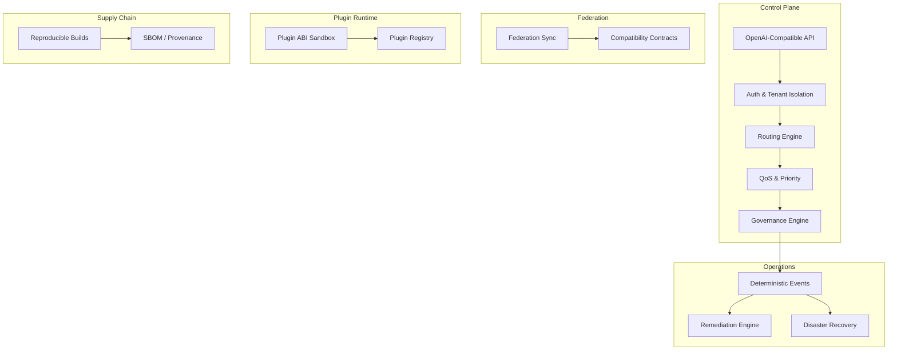

# LLM Inference Stack & Agentic AI Platform

**Sovereign, offline-first, deterministic AI platform with governed agentic runtime.**

> Current build: `v2.0.9`
> Supported docs: [`docs/CANONICAL_INDEX.md`](docs/CANONICAL_INDEX.md)  
> Supported surfaces: [`docs/support/supported-surface-area.md`](docs/support/supported-surface-area.md)  
> API classification: [`docs/api/supported-api-surface.md`](docs/api/supported-api-surface.md)  
> Generated references: [`docs/PRODUCT_SURFACE.md`](docs/PRODUCT_SURFACE.md), [`docs/API_REFERENCE.md`](docs/API_REFERENCE.md), [`docs/CONFIGURATION_REFERENCE.md`](docs/CONFIGURATION_REFERENCE.md), [`docs/FLAGS_INVENTORY.md`](docs/FLAGS_INVENTORY.md)

---

## Platform Architecture

### Principles

| Principle | Description |
|-----------|-------------|
| **Deterministic** | Every operation produces replayable, verifiable outputs. Event logs, receipts, and governance decisions are reproducible offline. |
| **Replay-Safe** | All state transitions can be replayed from event logs without side effects. No external dependencies required for verification. |
| **Offline-First** | The platform operates fully without internet connectivity. Cloud providers are optional additions, never requirements. |
| **Sovereign** | Operators retain full control over data, models, policies, and execution. No vendor lock-in, no mandatory telemetry. |
| **Advisory-First** | Validation, policy, and governance run in advisory/dry-run mode by default. Enforcement is explicit and operator-gated. |
- **Local-First, Hybrid-Ready**: Opt-in to cloud providers when local capacity is saturated.
- **Evolutionary Intelligence (v2.x)**: Promotes the platform from governed execution engine to safe-by-default evolutionary intelligence ecosystem with cognitive loopback, uncertainty controls, meta-reviewing, studio GA, debugger replay, shadow/canary agents, wallets, digital twins, standardized bundles, federated memory, and specialized reasoning primitives.
- **Platform Complete Hardening (v2.x)**: Formalizes profile-driven operations, real distributed-runtime primitives, metadata-safe managed control plane sync, capability catalog governance, and stricter production-claim rules.
- **Scale Hardening (v2.1.1)**: Adds opt-in Firecracker/gVisor sandbox providers, MCP delegated OAuth token exchange, PostgreSQL/pgvector/pgRouting GraphRAG, optimizer tournaments, and telemetry leaky-bucket backpressure without weakening defaults.
- **Enterprise Agentic Autonomy (v2.1.0)**: Adds governed code interpretation, graph-native RAG, event-driven agents, agent IAM, agentic CI/CD optimization controls, per-step router decisions, and shared artifact collaboration under explicit opt-in gates.
- **GA Readiness (v2.0.2)**: Tightens surface governance, explicit execution modes, production-ready capabilities, and opt-in provider validation into the final GA gate.
- **Operational Maturity (v2.0.1)**: Consolidates deployment modes, GA scoring, feature-flag hygiene, surface reduction, security warning governance, activation playbooks, and provider validation into an operator-ready release line.
- **Platform Consolidation (v1.9.8)**: Supportability and operational consolidation inside existing platform domains, plus lazy-loaded routers, endpoint cleanup, and release governance tightening.
- **Compliance Readiness (v1.9.7)**: Integrated SOC 2 & ISO 27001 preparation framework with automated evidence collection and ISMS governance.
- **Advanced Operational Experience (v1.9.5)**: Integrated performance tuning, enterprise onboarding, and visual observability dashboards.
- **CI/CD & Chaos Engineering (v1.9.6)**: Fully modular GitHub/GitLab pipelines with automated fault injection and supply chain security.
- **Enterprise-Grade Observability**: Full Grafana dashboards for GPU, Nodes, SLO, and Error Budgets.
- **Multi-Cluster Orchestration**: Real registration, heartbeat, placement, lease, and failover primitives exist, but enterprise distributed posture remains opt-in and release-gated.
- **Deterministic Governance**: Audit receipts for every inference, configuration change, and administrative action.

### Architecture Summary



### Bounded Contexts

The platform is organized into 12 bounded contexts with explicit contracts:

| Context | Role |
|---------|------|
| `core_runtime` | Deterministic runtime abstractions, local execution readiness |
| `governance` | Policy engine, approvals, compliance decisions |
| `federation` | Offline-first federation contracts and sync |
| `plugin_runtime` | Hardened plugin loading, ABI sandbox |
| `supply_chain` | Provenance, artifact lineage, reproducibility |
| `operations` | Deterministic workflows, events, recovery |
| `security` | Trust boundaries, crypto readiness, isolation |
| `financial` | Billing, finance governance |
| `sovereign` | Airgap, locality, tenant sovereignty |
| `observability` | Local metrics, traces, sanitized visibility |
| `data_governance` | Data zoning, lineage, retention |
| `disaster_recovery` | Backup manifests, replay verification |

See [Platform Domain Map](docs/architecture/platform_domain_map.md) for full context details and Mermaid diagram.

### Architecture & Observability
- [Standardized SLOs](docs/operations/slo.md)
- [Metrics Catalog](docs/observability/metrics-catalog.md)
- [Simplification Plan](docs/architecture/simplification-plan.md)
- [Deprecation Policy](docs/architecture/deprecation-policy.md)

### Phases 69-82 Flow

```mermaid
graph LR
    P69[Phase 69<br/>Failure Forecasting] --> P70[Phase 70<br/>Correlation Engine]
    P70 --> P71[Phase 71<br/>Remediation Planning]
    P71 --> P72[Phase 72<br/>Remediation Execution]
    P72 --> P73[Phase 73<br/>Adapter Sandbox]
    P73 --> P74[Phase 74<br/>Signed Registry]
    P74 --> P75[Phase 75<br/>Adapter Promotion]
    P75 --> P76[Phase 76<br/>Attestation Framework]
    P76 --> P77[Phase 77<br/>Federation Sync]
    P77 --> P78[Phase 78<br/>Compatibility Contracts]
    P78 --> P79[Phase 79<br/>Plugin ABI]
    P79 --> P80[Phase 80<br/>Plugin Supply Chain]
    P80 --> P81[Phase 81<br/>Reproducible Builds]
    P81 --> P82[Phase 82<br/>Platform Sustainability]
```



### Validation

```bash
# Smoke validation (static checks, fast)
make validate-architecture-smoke

# Full validation (complete suite)
make validate-architecture-full

# Platform documentation validation
make validate-platform-documentation
```

### Navigating the Documentation

| Document | Description |
|----------|-------------|
| [Documentation Index](docs/index.md) | Full index of all documentation |
| [Canonical Index](docs/CANONICAL_INDEX.md) | Source-of-truth list of supported docs |
| [Product Surface](docs/PRODUCT_SURFACE.md) | Generated capability status matrix |
| [Supported Surface Area](docs/support/supported-surface-area.md) | Official support policy |
| [API Reference](docs/API_REFERENCE.md) | Generated endpoint inventory |
| [Configuration Reference](docs/CONFIGURATION_REFERENCE.md) | Generated runtime configuration inventory |
| [Flags Inventory](docs/FLAGS_INVENTORY.md) | Generated feature flag inventory |
| [Runbook](docs/operations/platform_runbook.md) | Operations guide |

### Explicit Limitations

- **Plugin ABI Sandbox** — Plugin code execution is local and sandboxed, not unrestricted. Plugin ABI and plugin runtime surfaces support governed local execution for installed plugins under isolation policy.
- **Local PKI** — PKI, attestation and hardware trust are config-gated. When enabled, PKI can issue and verify local certificates, but hardware-backed trust still requires explicit platform support.
- **Policy-Based Attestation** — Default local installs keep `PKI_ENABLED=false`, `HARDWARE_TRUST_ENABLED=false` and advisory attestation behavior.
- **Offline-First** — The platform is designed for air-gapped environments; enterprise runtime surfaces are opt-in and preserve the local appliance by default.
- **Evidence-Driven Compliance** — No formal certification; validation is advisory and self-attested. No external audit body.

---

## O que é

O **Local AI Appliance** é uma stack completa de infraestrutura de IA on-premise, compatível com a API OpenAI. Ela roda inteiramente em hardware local (Linux ou WSL2), sem dependência de nuvem, fornecendo:

- Proxy de inferência OpenAI-compatible (`/v1/chat/completions`, streaming SSE)
- Portal de administração com dashboard, clientes, API keys, planos e billing manual
- RAG (busca semântica em documentos)
- TTS (text-to-speech local)
- Gestão de múltiplos modelos GGUF via Admin Lab
- Relatórios de segurança, readiness e produção

## Para quem serve

- **Empresas** que precisam de soberania de dados e não podem enviar dados para APIs externas
- **Integradores** que implantam soluções de IA on-premise para clientes finais
- **Operadores** que gerenciam múltiplos tenants com quotas, rate limiting e faturamento
- **Equipes de vendas** que precisam demonstrar o produto em reuniões offline

## Supported Surface Tiers

| Tier | Label | Description |
| :--- | :--- | :--- |
| `production_core` | **Production Core** | Produção. Sem mocks no caminho crítico. Readiness-gated. Defensível. |
| `production_optional` | **Production Optional** | Produção opt-in. Qualidade de produção, mas exige ativação explícita. |
| `beta` | **Beta** | Feature-complete mas evoluindo. Avaliar antes de usar em produção. |
| `experimental` | **Experimental** | Early stage. Pode mudar sem aviso. |
| `deprecated` | **Deprecated** | Compatibilidade temporária até remoção. |
| `internal` | **Internal** | Superfície interna de operador, fora do escopo público. |

> See [Product Surface Matrix](docs/PRODUCT_SURFACE.md) for the complete breakdown including all capabilities, owners, and promotion criteria.

> [!WARNING]
> **Production claims are narrower than code presence.** Features such as distributed runtime, multi-cluster, managed control plane, capability catalog, Firecracker/gVisor, and MCP/plugin supply-chain controls are implemented behind explicit flags and profiles, but only count as production-safe when non-mock gates and environment prerequisites pass. Do not represent code presence or unit coverage alone as production evidence. See the [Product Surface Matrix](docs/PRODUCT_SURFACE.md) and [Supported Surface Area](docs/support/supported-surface-area.md) policy for details.

### Release v2.x scope

- **Cognitive loopback is now enabled by default**: post-run feedback mining, learning candidates, and few-shot activation exist, and `AGENT_COGNITIVE_LOOPBACK_ENABLED=true` and `AGENT_AUTO_APPLY_LEARNINGS=true` enable autonomous learning out of the box.
- **Uncertainty and review are explicit**: uncertainty detection, optional auto-research, and meta-reviewer controls are available behind dedicated flags and remain advisory-first by default.
- **Studio becomes governable GA surface**: visual flow authoring, validation, compilation, and dry-run flows are operator-gated, auditable, and disabled by default.
- **Replay and rollout controls expand**: time-travel debugger, shadow mode, and canary promotion are available for agent debugging and promotion without changing the safe default posture.
- **Economic and physical side effects stay blocked**: wallets default to internal-only, external spend is disabled, digital twins are read-oriented, and physical actuation is disabled.
- **Federation and portability are bounded**: SAB import/export and federated memory sync are explicit opt-ins; raw federated sync remains disabled by default.
- **Reasoning broadens without weakening runtime posture**: MCTS and constraint-based reasoning are added as specialized, opt-in reasoning runtimes.

### Release v2.0.3 scope

- **TaskEngine is real-path safe**: task output validation uses the contract layer correctly, so successful executions do not fall back into retry/failure loops that repeat side effects.
- **AgentExecutor has no silent simulation**: disabled real execution now fails closed unless an explicit mock or dry-run mode is enabled and audit-visible.
- **Connector execution mode is explicit**: connectors run in `mock` or `real` mode only, with per-connector real enablement and no silent fallback from failed real calls into mock payloads.
- **Queue and scheduler are durable-first**: lease expiry, DLQ routing, idempotency, deduplication, and scheduler prerequisites are part of the hardened readiness posture.
- **Sandbox real execution is fail-closed**: real sandbox runs require a concrete implementation; only explicit `mock` or `dry_run` modes can emit simulated output.
- **Operator reconciliation is minimally real**: the Kubernetes operator now distinguishes `real`, `mock`, and `dry_run` modes while reconciling Deployments, Services, provider secret references, and status conditions.
- **Readiness gate is code-aware**: `make real-execution-readiness` now blocks production-like release posture on connector placeholders, implicit tool fallbacks, disabled durable queue, or non-real operator mode.
- **Provider validation evidence is stricter**: GA only counts a recent non-mock provider/gateway validation when `basic_model_call` actually passes.
- **Production-ready posture is fail-closed for GA**: mock provider usage remains acceptable for appliance development, but is not counted as production-safe evidence.

### Release v2.1.0 scope

- **Governed code execution**: Agent tool synthesis and code interpreter are available behind dedicated flags with sandbox network/write access disabled by default.
- **Graph-native RAG 2.0**: Knowledge graph extraction and Graph RAG are added as tenant-isolated extensions to memory and retrieval, with graph writes and external graph databases opt-in only.
- **Proactive agents**: Event-driven triggers, deliveries, and webhook/cron/pubsub hooks are available under rate limit, budget, and dedup governance.
- **Agent IAM**: Service principals, delegated token grants, and IAM audit trails provide governed connector identity for agents.
- **Agentic CI/CD optimization**: Optimization experiments, candidate evaluation, approval, and apply flows are now part of the platform, with automatic apply disabled by default.
- **Per-step Router 2.0**: Agentic Router V2 can classify steps, simulate policies, and persist auditable routing decisions.
- **Shared artifacts**: Collaborative workspaces and artifact registries add immutable versions, locks, reviews, and diffs, while shared workspace remains disabled by default.

### Release v2.0.1 scope

- **Operational modes made official**: `DEPLOYMENT_MODE` now defines the supported activation postures across `appliance`, `pilot`, `production`, and `enterprise_managed`.
- **Release evidence is objective**: GA classification, feature-flag audit, surface audit, security cleanup, validation summary, and rollout playbooks are now part of the release artifact set.
- **No unrestricted autonomy claims**: the platform still requires explicit runtime activation, approvals, and governed connectors before real side effects occur.
- **Supportability is bounded**: support bundles and security exceptions remain sanitized operational artifacts and do not widen tenant-facing scope.
- **Provider validation is explicit**: real-provider checks remain opt-in, budgeted, and report-driven.

### Critical layers and defaults

| Layer | Release posture | Key defaults |
|-----------|-------------|-------------|
| Governed SaaS connectors | Mock/governed external actions can be enabled without opening unrestricted network access. | `AGENT_SAAS_CONNECTORS_ENABLED=false`, `AGENT_CONNECTOR_WRITE_ENABLED=false`, `AGENT_CONNECTOR_EXTERNAL_NETWORK_ENABLED=false` |
| Stateful workflows | Long-running workflows can persist, sleep, and wake without holding workers when explicitly enabled. | `AGENT_STATEFUL_WORKFLOWS_ENABLED=false` |
| Reasoning/acting loop | Structured-output repair, ReAct-style execution, and context compression are present but opt-in. | `AGENT_REASONING_LOOP_ENABLED=false`, `AGENT_REACT_LOOP_ENABLED=false` |

### GA readiness criteria

`v2.0.2-agentic-ga-readiness` is only `GA_READY` when all 12 criteria in [docs/platform/ga-readiness.md](docs/platform/ga-readiness.md) pass. The most release-sensitive items are:

| Criterion | Gate |
|-----------|------|
| Surface governance | No unclassified endpoints and no API surface drift. |
| Provider validation | A recent non-mock provider or validated gateway must pass `basic_model_call`. |
| Production posture | No silent mock LLM path is accepted for production GA evidence. |
| Task execution posture | No completed task is accepted without explicit `execution_mode`. |

### Operational maturity controls

- Deployment modes: [docs/platform/deployment-modes.md](docs/platform/deployment-modes.md)
- Pilot vs production rollout: [docs/platform/pilot-vs-production.md](docs/platform/pilot-vs-production.md)
- Runtime activation playbooks: [docs/operations/agentic-rollout.md](docs/operations/agentic-rollout.md)
- GA readiness framework: [docs/platform/ga-readiness.md](docs/platform/ga-readiness.md)
- Feature-flag governance: [docs/platform/feature-flag-governance.md](docs/platform/feature-flag-governance.md)
- Security warning governance: [docs/security/warning-governance.md](docs/security/warning-governance.md)

## Quick start

```bash
# 1. Pré-requisitos: Docker, docker compose, git, curl, jq, python3
# 2. Configure o ambiente
cp .env.example .env.local
# Edite ADMIN_TOKEN, POSTGRES_PASSWORD, MODEL_FILE
# Mantenha os gates enterprise em false a menos que queira habilitar explicitamente:
# KUBERNETES_MODE=false
# DISTRIBUTED_RUNTIME_ENABLED=false
# GPU_AUTOSCALING_ENABLED=false
# PLUGIN_MARKETPLACE_ENABLED=false
# MANAGED_CONTROL_PLANE_ENABLED=false
# Mantenha a superfície agentic em modo seguro por padrão:
# AGENT_RUNTIME_ENABLED=false
# AGENT_REAL_LLM_ENABLED=false
# AGENT_LLM_PROVIDER=mock
# AGENT_EXECUTION_ENABLED=false
# AGENT_TOOL_ADAPTERS_ENABLED=false
# AGENT_TOOL_EXECUTION_ENABLED=false
# AGENT_MEMORY_ENABLED=false
# AGENT_MEMORY_SEMANTIC_SEARCH_ENABLED=false
# AGENT_MEMORY_CONTEXT_INJECTION_ENABLED=false
# AGENT_WORKER_ENABLED=false
# AGENT_EVALS_ENABLED=false
# AGENT_HUMAN_APPROVAL_ENABLED=true
# AGENT_SAAS_CONNECTORS_ENABLED=false
# AGENT_CONNECTOR_WRITE_ENABLED=false
# AGENT_CONNECTOR_EXTERNAL_NETWORK_ENABLED=false
# AGENT_STATEFUL_WORKFLOWS_ENABLED=false
# AGENT_REASONING_LOOP_ENABLED=false
# AGENT_REACT_LOOP_ENABLED=false
# AGENT_MULTI_AGENT_ENABLED=false
# AGENT_STUDIO_ENABLED=false
# AGENT_VISUAL_BUILDER_ENABLED=false
# AGENT_MARKETPLACE_ENABLED=false

# 3. Instale o appliance com dados de demonstração
make install-local

# 4. Valide a instalação
make validate
make security
make readiness
```

A stack sobe em `http://localhost:18080` com:
- Admin Dashboard: `/admin-dashboard` (token: `ADMIN_TOKEN`)
- Client Portal: `/client-portal`
- Admin Lab: `/admin-lab`
- API OpenAI: `/v1/chat/completions`

> Para validar uma máquina nova antes de instalar: `make fresh-machine-check` — consulte [FRESH_MACHINE_VALIDATION.md](docs/FRESH_MACHINE_VALIDATION.md).

## Customer demo

```bash
# Demo rápida (valida sem recriar dados)
make customer-demo

# Demo completa (seed de dados, reset, validação)
make customer-demo-full
```

Relatório gerado em `artifacts/customer-demo/<timestamp>/`.

### Documentos de apoio para reuniões

- [Guia de Configuração da Demo](docs/LOCAL_DEMO_GUIDE.md)
- [Roteiro de Demonstração Local](docs/LOCAL_DEMO_SCRIPT.md)
- [FAQ da Demo Local](docs/LOCAL_DEMO_FAQ.md)
- [Roteiro de Apresentação (15/30/60 min)](docs/CLIENT_PRESENTATION_SCRIPT.md)
- [Talk Track — Falas Prontas](docs/CLIENT_DEMO_TALK_TRACK.md)
- [FAQ da Demo Comercial](docs/CLIENT_DEMO_FAQ.md)
- [Objeções Comuns e Respostas](docs/CLIENT_DEMO_OBJECTIONS.md)

### Guia Visual de Demonstração

Storyboard, screenshots e plano de captura: [docs/demo-visual-guide/README.md](docs/demo-visual-guide/README.md)

## Screenshots / Visual Guide

| Interface | Descrição |
|-----------|-----------|
| Landing Page | `http://localhost:18080/` |
| Admin Dashboard | `http://localhost:18080/admin-dashboard` |
| Agent Studio | `http://localhost:18080/admin-dashboard/agents/studio` |
| Admin Lab | `http://localhost:18080/admin-lab` |
| Client Portal | `http://localhost:18080/client-portal` |
| Pricing | `http://localhost:18080/pricing` |

Consulte o [Guia Visual de Demonstração](docs/demo-visual-guide/README.md) para screenshots e fluxo de navegação.

## Instalação em cliente

Documentação simplificada para clientes finais que desejam instalar o sistema sem se aprofundar na arquitetura interna:

- Quickstart de container único:
```bash
docker run --gpus all -p 8080:8080 ghcr.io/llm-inference-stack/quickstart:latest
```
- Instalador interativo:
```bash
llmstack install
llmstack install --non-interactive --target-dir ./deploy/generated
```
- Backup e recuperação:
```bash
llmstack backup --logical-agent-backup
llmstack restore BACKUP_ID --dry-run
llmstack restore BACKUP_ID --yes
```
- [Guia de Requisitos do Sistema](docs/CUSTOMER_REQUIREMENTS.md)
- [Guia de Instalação](docs/CUSTOMER_INSTALL_GUIDE.md)
- [Quickstart Mode](QUICKSTART.md)
- [Install Wizard](docs/INSTALL_WIZARD.md)
- [Quickstart (Caminho Curto)](docs/CUSTOMER_QUICKSTART.md)
- [Solução de Problemas (Troubleshooting)](docs/CUSTOMER_TROUBLESHOOTING.md)
- [Paid Implementation Checklist](docs/PAID_IMPLEMENTATION_CHECKLIST.md)

### Integração via API

```bash
# Listar modelos
curl -fsS http://localhost:18080/v1/models \
  -H "Authorization: Bearer ${API_KEY}" | python3 -m json.tool

# Chat completion
curl -N http://localhost:18080/v1/chat/completions \
  -H "Authorization: Bearer ${API_KEY}" \
  -H "Content-Type: application/json" \
  -d '{
    "model": "unsloth/gemma-4-E4B-it-GGUF",
    "messages": [{"role": "user", "content": "Olá!"}],
    "stream": false
  }'
```

Cliente Python SDK: [README_CLIENT.md](README_CLIENT.md)  
Exemplos completos: [`examples/`](examples/)  
Integrações (Open WebUI, n8n, LangChain): [`docs/integrations/`](docs/integrations/)

## Operação diária

```bash
# Subir/descer a stack
./scripts/deploy/up.sh
./scripts/deploy/down.sh

# Validar saúde
make health

# Validar produção
make validate

# Backup e restore
make backup
make rollback
make upgrade

# Ver logs
docker compose logs -f control-plane

# Métricas
curl -fsS http://localhost:18080/metrics
```

Documentação operacional detalhada:
- [Local Production Runbook](docs/LOCAL_PRODUCTION_RUNBOOK.md)
- [Operator Commands](docs/OPERATOR_COMMANDS.md)
- [Operator Error Codes](docs/OPERATOR_ERROR_CODES.md)
- [Guia de Validação](docs/LOCAL_PRODUCTION_VALIDATION.md)
- [White-Label / Branding](docs/WHITE_LABEL_LOCAL.md)

## Segurança / Readiness

```bash
# Relatório de segurança
make security

# Readiness check
make readiness

# Verificar health
make health

# Fresh machine validation (máquina nova)
make fresh-machine-check

# Escanear secrets no código
./scripts/validators/check-secrets.sh --all

# Fase de Estabilização (Checks formais)
make stabilization-check

# Relatório de risco de release
make release-risk-report

# Validar ambiente de providers reais
make validate-real-provider-env
```

- [Canonical Documentation Index](docs/CANONICAL_INDEX.md)
- [Documentation Archive](docs/archive/README.md)
- [Security Report](docs/SECURITY_LOCAL.md)
- [Production Readiness](docs/PRODUCTION_READINESS_LOCAL.md)
- [Disaster Recovery](docs/DISASTER_RECOVERY_LOCAL.md)
- [Retention Policy](docs/RETENTION_LOCAL.md)

## Limitações

- **PSP real está fora do escopo.** O sistema simula faturamento com invoices e ciclos, mas não processa pagamentos reais.
- **PIX real está fora do escopo.** Não há integração com gateways de pagamento brasileiros.
- **Modos Operacionais Controlados.** A ativação de features é governada pela variável `DEPLOYMENT_MODE`. O modo padrão é `appliance` (totalmente local e com runtime desativado). Outros modos suportados são `pilot` (sandboxes de teste com escritas externas bloqueadas e orçamentos estritos), `production` (ambientes produtivos com eval gates e SLOs mandatórios) e `enterprise_managed` (multi-cluster federado com isolamento estrito de tenants).
- **Modelos dependem do hardware local.** Desempenho varia conforme GPU, RAM e quantização. Consulte [docs/MODEL_BENCHMARK_LOCAL.md](docs/MODEL_BENCHMARK_LOCAL.md).
- **Recursos opcionais dependem de configuração.** RAG, TTS, observabilidade, cache e providers cloud requerem ativação explícita em `.env.local`.
- **RBAC administrativo ativado por padrão.** `RBAC_ADMIN_ENABLED=true` garante autorização granular, substituindo o fluxo legado de token único.
- **Troca de modelo GGUF é opt-in.** Com `MODEL_HOT_SWAP_ENABLED=false`, o comportamento continua sendo o fluxo antigo sem supervisor de runtimes.
- **Marketplace permanece offline-first.** O fluxo de marketplace usa artefatos locais importados pelo operador; não depende de catálogo remoto para funcionar.
- **Autoscaling de GPU é advisory por padrão.** Mesmo quando habilitado, a política inicial opera em `mode=recommendation` até que o operador promova para ação ativa.
- **Cálculo de tokens pode usar fallback estimado.** `TOKENIZER_MODE=auto` tenta tokenizer real e recua para estimativa quando necessário.
- **Cancelamento de geração** depende do encerramento da conexão HTTP do stream.

## Enterprise Packaging

O LLM Inference Stack está pronto para pilotos enterprise e implantações em produção com um fluxo estruturado de onboarding e entrega.

### Pacotes Comerciais
- **Pilot Pack**: Avaliação de curta duração (30-90 dias) em ambientes de sandbox.
- **On-Prem Enterprise Pack**: Implantação completa em produção na infraestrutura gerenciada pelo cliente.
- **Sovereign AI Appliance Pack**: Solução hardware+software air-gapped para máxima soberania.
- **Managed Control Plane Pack**: Control Plane gerenciado (SaaS) com execução local do Data Plane.
- **Support & Maintenance**: Suporte técnico 24/7 e ajuste de performance contínuo.

### Ferramentas Enterprise
Scripts automatizados para gerar artefatos de entrega:
- `./scripts/deploy/up.sh`: sobe a stack suportada.
- `./scripts/deploy/down.sh`: desce a stack suportada.
- `./scripts/dev/generate-support-bundle.sh`: gera pacote de diagnóstico suportado.

### Documentação e Compliance
Recursos abrangentes disponíveis em:
- `docs/enterprise/`: Guias de onboarding, questionários de segurança e planos de teste.
- `commercial/templates/`: SOW, Termos de Suporte e Fronteiras de Processamento de Dados.
- `commercial/checklists/`: Checklists rigorosos para cada fase da entrega.

## Documentação

| Documento | Conteúdo |
|-----------|----------|
| [Canonical Index](docs/CANONICAL_INDEX.md) | Classificação oficial da documentação |
| [Documentation Index](docs/index.md) | Navegação da documentação suportada |
| [Product Surface](docs/PRODUCT_SURFACE.md) | Matriz gerada de capacidades e status |
| [Supported Surface Area](docs/support/supported-surface-area.md) | Política oficial de superfícies suportadas |
| [Supported API Surface](docs/api/supported-api-surface.md) | Classificação dos endpoints suportados |
| [API Reference](docs/API_REFERENCE.md) | Inventário gerado de endpoints |
| [Configuration Reference](docs/CONFIGURATION_REFERENCE.md) | Referência gerada de configuração |
| [Flags Inventory](docs/FLAGS_INVENTORY.md) | Inventário gerado de flags |
| [Documentation Archive](docs/archive/README.md) | Histórico e material descontinuado |
| [OpenAI Compatibility](docs/OPENAI_COMPATIBILITY.md) | Detalhes da API compatível |
| [Platform Runbook](docs/operations/platform_runbook.md) | Operação diária suportada |

## Release History

O material histórico de release foi movido para [docs/archive/releases/](docs/archive/releases/).

## Roadmap

- Autenticação administrativa com RBAC e rotação de credenciais
- Configuração dinâmica persistida com cache invalidation
- Fila distribuída e workers externos para múltiplos data planes
- Tokenizer real para contabilidade de tokens
- Tracing distribuído e retenção externa de métricas/logs

## Suporte a Dispositivos Móveis e UI Responsiva

Ambos os portais (**Admin Dashboard** e **Client Portal**) foram refatorados para oferecer uma experiência fluida em qualquer tamanho de tela, seguindo a abordagem **mobile-first**:

- **Layout Mobile:** Sidebar colapsável com menu hambúrguer e backdrop para navegação intuitiva em smartphones.
- **Tabelas Inteligentes:** Em telas pequenas (até 768px), as tabelas de dados (clientes, modelos, faturas) são automaticamente convertidas em "cards" verticais, garantindo legibilidade.
- **Gráficos Flexíveis:** Dashboards de uso utilizam containers responsivos que se ajustam proporcionalmente ao redimensionar a janela.
- **Playground Otimizado:** O ambiente de chat e configuração de parâmetros foi reorganizado para empilhamento vertical no mobile, permitindo testes rápidos de qualquer lugar.
- **Modais de Ação:** Modais de pagamento (como o QR Code do PIX) e formulários ocupam a tela cheia em dispositivos móveis para facilitar a interação.
- **Breakpoints Utilizados:** Otimização específica para 375px (iPhone SE), 768px (iPad) e 1280px+ (Desktop).

### Tecnologias Frontend

- **Framework:** React 19 + TypeScript
- **Estilização:** Tailwind CSS v4
- **Ícones:** Lucide React
- **Gráficos:** Recharts (Responsive Containers)
- **Build Tool:** Vite 8

---

*Local AI Appliance — consulte [docs/CANONICAL_INDEX.md](docs/CANONICAL_INDEX.md) para a documentação suportada e [docs/archive/releases/](docs/archive/releases/) para histórico.*
