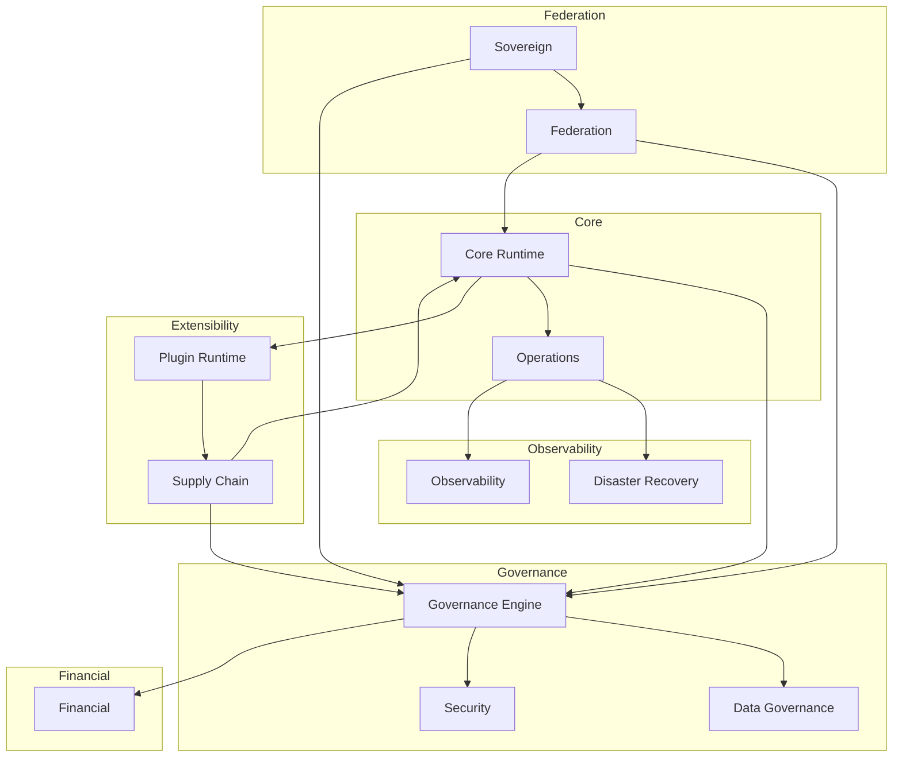

<!-- synced_from: docs/architecture/platform_domain_map.md -->

> Source of truth: `docs/architecture/platform_domain_map.md`

---
owner: platform-ops
status: consolidated
---

# Platform Domain Map

## Bounded Context Map

## Bounded Context Details

### Core Runtime
- Deterministic execution boundaries
- Local inference readiness
- No real runtime execution
- Replay-safe event production

### Governance
- Policy engine with advisory-only mode
- Approval workflows
- Compliance decisions
- No enforcement without human approval

### Federation
- Offline-first sync protocols
- Environment registry
- Trust negotiation
- Conflict resolution

### Plugin Runtime
- Formal ABI contracts (placeholder)
- Capability boundaries
- Extension loading sandbox
- No real plugin execution

### Supply Chain
- SBOM framework (placeholder)
- Artifact lineage tracking
- Reproducible build verification
- Provenance receipts

### Operations
- Deterministic event architecture
- Remediation planning & execution
- Failure forecasting & correlation
- Approval-gated runbooks

### Security
- Trust boundaries (advisory)
- Crypto readiness planning
- Tenant isolation rules
- No real hardware trust

### Financial
- Billing governance contracts
- Financial reconciliation rules
- Revenue protection policies

### Sovereign
- Airgap constraints
- Locality requirements
- Tenant sovereignty
- Export controls

### Observability
- Local metrics & traces
- Sanitized operational visibility
- Deterministic audit events

### Data Governance
- Data zoning rules
- Lineage tracking
- Retention policies
- Export controls

### Disaster Recovery
- Backup manifest verification
- Replay verification
- Dry-run recovery governance

## Module Boundaries

| Context | Inbound Contracts | Outbound Contracts |
|---------|------------------|-------------------|
| Core Runtime | Federation sync, Plugin ABI | Governance events, Operations events |
| Governance | All contexts' events | Policy decisions, Approval status |
| Federation | Sovereign constraints | Core Runtime state |
| Plugin Runtime | Supply Chain artifacts | Core Runtime extensions |
| Supply Chain | Plugin artifacts | Build verification |
| Operations | Runtime events | Governance approvals |
| Security | Governance policies | Isolation enforcement |
| Sovereign | Federation context | Governance policies |
