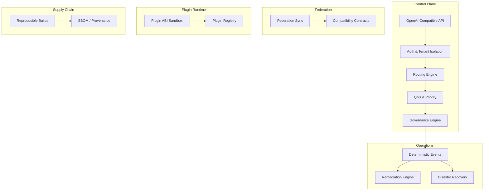

<!-- synced_from: docs/architecture/platform_overview.md -->

> Source of truth: `docs/architecture/platform_overview.md`

---
owner: platform-ops
status: consolidated
---

# Platform Overview

## What It Is

The LLM Inference Stack is a sovereign, offline-first, deterministic AI inference platform. It is designed for multi-tenant, multi-provider inference serving with verifiable execution, governance-controlled policy enforcement, and federation capabilities — all without mandatory SaaS dependencies.

## Design Principles

| Principle | Description |
|-----------|-------------|
| **Deterministic** | Every operation produces replayable, verifiable outputs. Event logs, receipts, and governance decisions are reproducible offline. |
| **Replay-Safe** | All state transitions can be replayed from event logs without side effects. No external dependencies required for verification. |
| **Offline-First** | The platform operates fully without internet connectivity. Cloud providers are optional additions, never requirements. |
| **Sovereign** | Operators retain full control over data, models, policies, and execution. No vendor lock-in, no mandatory telemetry. |
| **Advisory-First** | Validation, policy, and governance run in advisory/dry-run mode by default. Enforcement is explicit and operator-gated. |

## Architecture Summary



## Bounded Contexts Overview

The platform is organized into bounded contexts with explicit contracts between them:

- **core_runtime** — deterministic runtime abstractions, local execution readiness
- **governance** — policy engine, approvals, compliance decisions
- **federation** — offline-first federation contracts and sync
- **plugin_runtime** — hardened plugin loading, ABI sandbox
- **supply_chain** — provenance, artifact lineage, reproducibility
- **operations** — deterministic workflows, events, recovery
- **security** — trust boundaries, crypto readiness, isolation
- **financial** — billing, finance governance
- **sovereign** — airgap, locality, tenant sovereignty
- **observability** — local metrics, traces, sanitized visibility
- **data_governance** — data zoning, lineage, retention
- **disaster_recovery** — backup manifests, replay verification

## Phases 69–82 Flow

```mermaid
graph LR
    P69[Phase 69<br/>Failure Forecasting] --> P70[Phase 70<br/>Correlation Engine]
    P70 --> P71[Phase 71<br/>Remediation Planning]
    P71 --> P72[Phase 72<br/>Remediation Execution]
    P72 --> P73[Phase 73<br/>Adapter Sandbox]
    P73 --> P74[Phase 74<br/>Signed Registry]
    P74 --> P75[Phase 75<br/>Adapter Promotion]
    P75 --> P76[Phase 76<br/>Attestation Framework]
    P76 --> P77[Phase 77<br/>Federation Sync]
    P77 --> P78[Phase 78<br/>Compatibility Contracts]
    P78 --> P79[Phase 79<br/>Plugin ABI]
    P79 --> P80[Phase 80<br/>Plugin Supply Chain]
    P80 --> P81[Phase 81<br/>Reproducible Builds]
    P81 --> P82[Phase 82<br/>Platform Sustainability]
```



## Validation

```bash
# Smoke validation (static checks, fast)
make validate-architecture-smoke

# Full validation (includes slow tests)
make validate-architecture-full

# Platform documentation validation
make validate-platform-documentation
```

## Explicit Limitations

- Plugin ABI Sandbox — Plugin execution is governed by sandboxed ABI contracts and explicit isolation policy.
- Local PKI — Certificate operations use local issuance; no external CA integration is provided by default.
- Policy-Based Attestation — Attestation and trust decisions are advisory-first and operator-enforced.
- Offline-First — All operations are designed for air-gapped environments.
- Evidence-Driven Compliance — Validation is based on cryptographic evidence, not formal third-party certification.

## Navigation

| Document | Description |
|----------|-------------|
| [Platform Domain Map](domain-map.md) | Bounded context map and module boundaries |
| Guarantees & Limitations (`platform_guarantees_and_limitations.md`) | Formal guarantees and explicit non-goals |
| Operational Model (`platform_operational_model.md`) | How the platform operates offline-first |
| Validation Workflows (`platform_validation_workflows.md`) | Smoke, full, and recovery validation |
| Module Relationships (`platform_module_relationships.md`) | Module dependency graph |
| Glossary (`platform_glossary.md`) | Terminology reference |
| Phase Timeline (`platform_phase_timeline.md`) | Phase 69–82 evolution |
| [Runbook](../operations/platform-runbook.md) | Operations guide |
| Docs Index (`../index.md`) | Full documentation index |
