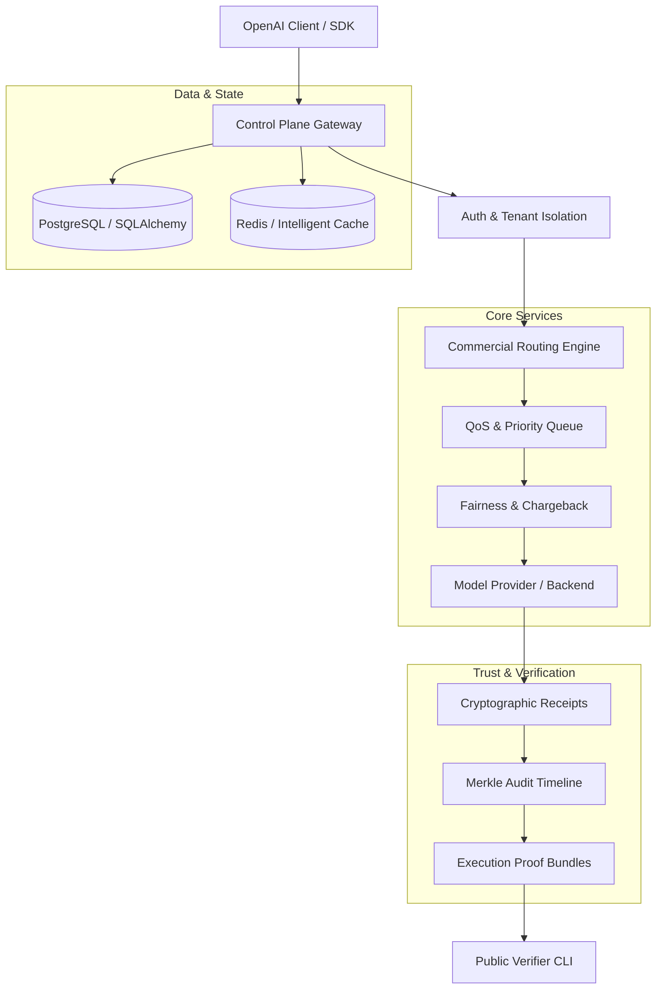
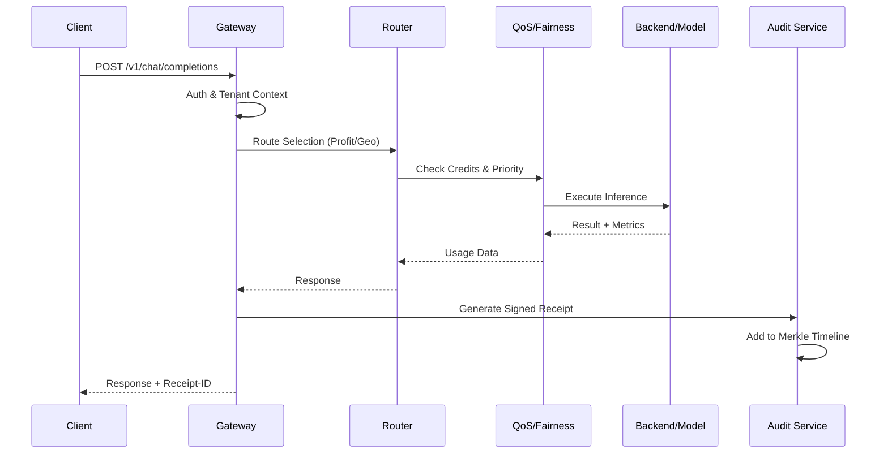

# Architecture Overview: LLM Inference Stack

The LLM Inference Stack is a high-performance, multi-tenant, and verifiable platform for deploying and managing Large Language Models at scale. It combines OpenAI-compatible inference with advanced commercial features for routing, billing, and compliance.

## High-Level Design



## Core Modules

### 1. Inference & OpenAI Compatibility
Provides a drop-in replacement for OpenAI endpoints (`/v1/chat/completions`, etc.), supporting streaming, function calling, and structured outputs.

### 2. Commercial Routing Engine
- **Geo-Routing**: Routes requests based on client location.
- **Profit-Routing**: Selects providers based on current margin and cost.
- **Cross-Cluster Forwarding**: Highly available distribution across regions.
- **Live Balancing**: Dynamic traffic shifting between healthy nodes.

### 3. QoS & Resource Management
- **Priority Queues**: Tiered access for free vs. premium users.
- **Fairness & Chargeback**: Prevents "noisy neighbor" issues and tracks usage for internal billing.
- **Capacity Planning**: Predicts and manages hardware allocation.

### 4. Billing & Revenue Protection
- **Prepaid Wallet (BRL)**: Native support for PIX and local payments.
- **Financial Reconciliation**: Automated balancing of provider costs vs. client revenue.
- **Revenue Protection**: Anomaly detection to prevent billing leakage.

### 5. Compliance & Sovereign Governance
- **Policy-as-Code**: Enforces organizational rules at the inference level.
- **Sovereign Airgap**: Control plane operations in restricted environments.
- **Governance Federation**: Shared audit trails across multiple clusters.

### 6. Trust Chain (Phase 40-43)
- **Model Supply Chain**: Verifies model weights and provenance.
- **Runtime Integrity**: Cryptographic attestation of the inference environment.
- **Cryptographic Receipts**: Signed proof of every inference result.
- **Merkle Audit Timelines**: Immutable, time-sealed logs of all activity.

## Request Flow (OpenAI-Compatible)



## System Constraints

- **Tenant Isolation**: No data leakage between clients.
- **Zero Exposure**: Auditing (Merkle/Proofs) never stores raw prompt/response data.
- **Scalability**: Stateless Control Plane with distributed worker pools.
- **High Availability**: Leader election and automated failover for critical services.

## Architecture Validation

Run the unified architecture validation suite with:

```bash
make validate-platform-architecture
```

See [validation/platform_architecture_validation.md](validation/platform_architecture_validation.md) for details.

---

**Next Steps**: See [SYSTEM_MAP.md](SYSTEM_MAP.md) for a detailed directory of all modules.
