# Release History

Historico consolidado das versoes estaveis do LLM Inference Stack.

**Gerado em:** 2026-05-19 16:27:18

## Visao Geral

O projeto evolui de uma prova de conceito (v1.0.0-beta) atraves de releases focadas em
producao local (v1.4.x-v1.5.x), compatibilidade com OpenAI (v1.6.0), hardening de produto
(v1.6.1), polimento do instalador (v1.6.2), cleanup de readiness (v1.6.3),
demo pack comercial (v1.6.4) e fluxos de sales ops (v1.6.5).

## Linha do Tempo

```mermaid
timeline
    title LLM Inference Stack Releases
    2026-04-30 : 1.0.0-beta : Legacy
    2026-05-01 : 1.1.0-local-production : Legacy
    2026-05-01 : 1.1.1-local-production : Legacy
    2026-05-02 : 1.2.0-admin-lab : Legacy
    2026-05-02 : 1.2.1-mock-fix : Legacy
    2026-05-03 : 1.2.1-model-management : Legacy
    2026-05-04 : 1.2.2-model-management : Legacy
    2026-05-04 : 1.2.3-model-management : Legacy
    2026-05-05 : 1.2.4-model-management : Legacy
    2026-05-05 : 1.2.5-model-management : Legacy
    2026-05-05 : 1.2.6-model-management : Legacy
    2026-05-05 : 1.2.7-model-management : Legacy
    2026-05-05 : 1.2.8-model-management : Legacy
    2026-05-05 : 1.3.0-model-management : Legacy
    2026-05-05 : 1.3.1-model-management : Legacy
    2026-05-06 : 1.3.2-model-management : Legacy
    2026-05-06 : 1.3.3-model-management : Legacy
    2026-05-06 : 1.4.0-model-management : Legacy
    2026-05-07 : 1.4.1-model-management : Legacy
    2026-05-07 : 1.4.2-local-production : Legacy
    2026-05-07 : 1.4.3-local-hardening : Legacy
    2026-05-07 : 1.4.3-local-production : Legacy
    2026-05-07 : 1.4.4-local-hardening : Legacy
    2026-05-07 : 1.4.5-local-hardening : Legacy
    2026-05-07 : 1.4.6-local-hardening : Legacy
    2026-05-07 : 1.4.7-local-demo : Legacy
    2026-05-08 : 1.5.0-local-production : Local Production / Ops
    2026-05-08 : 1.5.1-local-production : Local Production / Ops
    2026-05-08 : 1.5.3-local-ops : Local Production / Ops
    2026-05-08 : 1.5.4-security-cleanup : Security
    2026-05-09 : 1.5.5-security-artifacts-clean : Security
    2026-05-09 : 1.5.6-runtime-hardening : Runtime
    2026-05-09 : 1.6.0-openai-compat : OpenAI Compatibility
    2026-05-09 : 1.6.1-openai-compat : Product Hardening
    2026-05-10 : 1.6.1-product-hardening : Product Hardening
    2026-05-11 : 1.6.2-installer-polish : Installer Polish
    2026-05-11 : 1.6.3-readiness-cleanup : Readiness Cleanup
    2026-05-11 : 1.6.4-customer-demo-pack : Customer Demo Pack
    2026-05-12 : 1.6.5-sales-ops : Sales Ops
    2026-05-12 : 1.6.6-repo-cleanup : Legacy
    2026-05-12 : 1.6.7-final-qa : Legacy
    2026-05-12 : 1.7.0-local-ai-appliance : Legacy
    2026-05-13 : 1.7.1-post-release-polish : Legacy
    2026-05-13 : 1.8.0-hybrid-ai-platform : Legacy
    2026-05-13 : 1.8.1-real-provider-validation : Legacy
    2026-05-17 : 1.8.2-openrouter-integration : Legacy
    2026-05-18 : 1.8.3-admin-policy-controls : Legacy
    2026-05-18 : 1.8.4-portal-tts-transparency : Legacy
    2026-05-15 : 1.9.0-sovereign-platform : Legacy
    2026-05-18 : 1.9.1-frontend-modularization : Legacy
    2026-05-18 : 1.9.2-admin-v2-modular-ui : Legacy
    2026-05-18 : 1.9.2-platform-hardening : Legacy
    2026-05-18 : 1.9.3-platform-hardening : Legacy
    2026-05-19 : 1.9.3-stabilization-hardening : Legacy
    2026-05-19 : 1.9.4-platform-hardening : Legacy
    2026-05-16 : 1.10.0-v1-rc1 : Legacy
```



## Releases

| Versao | Tag | Branch Stable | Commit | Data | Categoria | Status | Objetivo |
|--------|-----|---------------|--------|------|-----------|--------|----------|
| 1.0.0-beta | `v1.0.0-beta` | — | `61060e4` | 2026-04-30 | Legacy | archived | — |
| 1.1.0-local-production | `v1.1.0-local-production` | — | `d7ccd0b` | 2026-05-01 | Legacy | archived | — |
| 1.1.1-local-production | `v1.1.1-local-production` | — | `9350e87` | 2026-05-01 | Legacy | archived | — |
| 1.2.0-admin-lab | `v1.2.0-admin-lab` | — | `062abe7` | 2026-05-02 | Legacy | archived | — |
| 1.2.1-mock-fix | `v1.2.1-mock-fix` | — | `52f143a` | 2026-05-02 | Legacy | archived | — |
| 1.2.1-model-management | `v1.2.1-model-management` | — | `156d03f` | 2026-05-03 | Legacy | archived | — |
| 1.2.2-model-management | `v1.2.2-model-management` | — | `91a01d9` | 2026-05-04 | Legacy | archived | — |
| 1.2.3-model-management | `v1.2.3-model-management` | — | `91a01d9` | 2026-05-04 | Legacy | archived | — |
| 1.2.4-model-management | `v1.2.4-model-management` | — | `7e9761c` | 2026-05-05 | Legacy | archived | — |
| 1.2.5-model-management | `v1.2.5-model-management` | — | `90bfc82` | 2026-05-05 | Legacy | archived | — |
| 1.2.6-model-management | `v1.2.6-model-management` | — | `90bfc82` | 2026-05-05 | Legacy | archived | — |
| 1.2.7-model-management | `v1.2.7-model-management` | — | `7a76bc8` | 2026-05-05 | Legacy | archived | — |
| 1.2.8-model-management | `v1.2.8-model-management` | — | `1ad498e` | 2026-05-05 | Legacy | archived | — |
| 1.3.0-model-management | `v1.3.0-model-management` | — | `66319af` | 2026-05-05 | Legacy | archived | — |
| 1.3.1-model-management | `v1.3.1-model-management` | — | `91dd874` | 2026-05-05 | Legacy | archived | — |
| 1.3.2-model-management | `v1.3.2-model-management` | — | `1a1e588` | 2026-05-06 | Legacy | archived | — |
| 1.3.3-model-management | `v1.3.3-model-management` | — | `2b0c6ed` | 2026-05-06 | Legacy | archived | — |
| 1.4.0-model-management | `v1.4.0-model-management` | — | `be5e8cd` | 2026-05-06 | Legacy | archived | — |
| 1.4.1-model-management | `v1.4.1-model-management` | — | `4d51c88` | 2026-05-07 | Legacy | archived | — |
| 1.4.2-local-production | `v1.4.2-local-production` | — | `7a63921` | 2026-05-07 | Legacy | archived | — |
| 1.4.3-local-hardening | `v1.4.3-local-hardening` | — | `3e17e6e` | 2026-05-07 | Legacy | archived | 2026-05-07; Logging padronizado dos validadores para melhor  |
| 1.4.3-local-production | `v1.4.3-local-production` | — | `cf02258` | 2026-05-07 | Legacy | archived | — |
| 1.4.4-local-hardening | `v1.4.4-local-hardening` | — | `3e17e6e` | 2026-05-07 | Legacy | archived | — |
| 1.4.5-local-hardening | `v1.4.5-local-hardening` | — | `2c72fb5` | 2026-05-07 | Legacy | archived | — |
| 1.4.6-local-hardening | `v1.4.6-local-hardening` | — | `2c72fb5` | 2026-05-07 | Legacy | archived | — |
| 1.4.7-local-demo | `v1.4.7-local-demo` | — | `5307faa` | 2026-05-07 | Legacy | archived | — |
| 1.5.0-local-production | `v1.5.0-local-production` | — | `f7c6b62` | 2026-05-08 | Local Production / Ops | archived | — |
| 1.5.1-local-production | `v1.5.1-local-production` | stable/v1.5.1-local-production | `07e2deb` | 2026-05-08 | Local Production / Ops | archived | 2026-05-08; fixed release metadata version source; aligned r |
| 1.5.3-local-ops | `v1.5.3-local-ops` | stable/v1.5.3-local-ops | `73805b0` | 2026-05-08 | Local Production / Ops | archived | — |
| 1.5.4-security-cleanup | `v1.5.4-security-cleanup` | stable/v1.5.4-security-cleanup | `2fdd362` | 2026-05-08 | Security | archived | 2026-05-08; security report cleanup workflow; release artifa |
| 1.5.5-security-artifacts-clean | `v1.5.5-security-artifacts-clean` | stable/v1.5.5-security-artifacts-clean | `d9588af` | 2026-05-09 | Security | archived | 2026-05-09; artifact secret diagnosis; source redaction for  |
| 1.5.6-runtime-hardening | `v1.5.6-runtime-hardening` | stable/v1.5.6-runtime-hardening | `8f324dc` | 2026-05-09 | Runtime | archived | 2026-05-09; Runtime health e admin deep health com sanitizaç |
| 1.6.0-openai-compat | `v1.6.0-openai-compat` | stable/v1.6.0-openai-compat | `113808b` | 2026-05-09 | OpenAI Compatibility | archived | — |
| 1.6.1-openai-compat | `v1.6.1-openai-compat` | — | `e485ec6` | 2026-05-09 | Product Hardening | archived | — |
| 1.6.1-product-hardening | `v1.6.1-product-hardening` | stable/v1.6.1-product-hardening | `e414b22` | 2026-05-10 | Product Hardening | archived | 2026-05-10; Makefile consolidado como entrypoint operacional |
| 1.6.2-installer-polish | `v1.6.2-installer-polish` | stable/v1.6.2-installer-polish | `b34667b` | 2026-05-11 | Installer Polish | archived | 2026-05-11; Instalador local `install-local-appliance.sh` e  |
| 1.6.3-readiness-cleanup | `v1.6.3-readiness-cleanup` | stable/v1.6.3-readiness-cleanup | `473b07f` | 2026-05-11 | Readiness Cleanup | archived | 2026-05-11; Correção de warnings do Production Readiness rep |
| 1.6.4-customer-demo-pack | `v1.6.4-customer-demo-pack` | stable/v1.6.4-customer-demo-pack | `874e0dc` | 2026-05-11 | Customer Demo Pack | active | 2026-05-11; Demo pack comercial com 5 cenarios (clinica, jur |
| 1.6.5-sales-ops | `v1.6.5-sales-ops` | stable/v1.6.5-sales-ops | `8db6be3` | 2026-05-12 | Sales Ops | active | 2026-05-12; CRM local simples para leads com fluxo comercial |
| 1.6.6-repo-cleanup | `v1.6.6-repo-cleanup` | stable/v1.6.6-repo-cleanup | `1c89b0c` | 2026-05-12 | Legacy | archived | 2026-05-12; Consolidacao do layout do repositorio com arquiv |
| 1.6.7-final-qa | `v1.6.7-final-qa` | stable/v1.6.7-final-qa | `7814bf0` | 2026-05-12 | Legacy | archived | 2026-05-12; Client Ready Report consolidado com artifacts JS |
| 1.7.0-local-ai-appliance | `v1.7.0-local-ai-appliance` | stable/v1.7.0-local-ai-appliance | `1645718` | 2026-05-12 | Legacy | archived | 2026-05-12; Consolidação da linha v1.6.x (v1.6.0 a v1.6.7).; |
| 1.7.1-post-release-polish | `v1.7.1-post-release-polish` | stable/v1.7.1-post-release-polish | `f73fbe7` | 2026-05-13 | Legacy | archived | 2026-05-13; Diagnóstico e limpeza de warnings não bloqueante |
| 1.8.0-hybrid-ai-platform | `v1.8.0-hybrid-ai-platform` | stable/v1.8.0-hybrid-ai-platform | `bb09499` | 2026-05-13 | Legacy | archived | 2026-05-13; Suporte híbrido multi-provider para inferência l |
| 1.8.1-real-provider-validation | `v1.8.1-real-provider-validation` | stable/v1.8.1-real-provider-validation | `28ccb53` | 2026-05-13 | Legacy | archived | 2026-05-13; Validação real opt-in para OpenAI, DeepSeek e An |
| 1.8.2-openrouter-integration | `v1.8.2-openrouter-integration` | — | `b706936` | 2026-05-17 | Legacy | archived | — |
| 1.8.3-admin-policy-controls | `v1.8.3-admin-policy-controls` | — | `1af3356` | 2026-05-18 | Legacy | archived | — |
| 1.8.4-portal-tts-transparency | `v1.8.4-portal-tts-transparency` | — | `2ff7302` | 2026-05-18 | Legacy | archived | — |
| 1.9.0-sovereign-platform | `v1.9.0-sovereign-platform` | — | `31912b9` | 2026-05-15 | Legacy | archived | — |
| 1.9.1-frontend-modularization | `v1.9.1-frontend-modularization` | — | `31fbacb` | 2026-05-18 | Legacy | archived | — |
| 1.9.2-admin-v2-modular-ui | `v1.9.2-admin-v2-modular-ui` | — | `6a024f2` | 2026-05-18 | Legacy | archived | — |
| 1.9.2-platform-hardening | `v1.9.2-platform-hardening` | — | `4b53b5d` | 2026-05-18 | Legacy | archived | — |
| 1.9.3-platform-hardening | `v1.9.3-platform-hardening` | — | `51d6f3b` | 2026-05-18 | Legacy | archived | — |
| 1.9.3-stabilization-hardening | `v1.9.3-stabilization-hardening` | — | `259ba7a` | 2026-05-19 | Legacy | current | — |
| 1.9.4-platform-hardening | `v1.9.4-platform-hardening` | — | `acb4f86` | 2026-05-19 | Legacy | archived | — |
| 1.10.0-v1-rc1 | `v1.10.0-v1-rc1` | — | `4fe31f7` | 2026-05-16 | Legacy | archived | — |

## Releases Recomendadas

| Versao | Motivo |
|--------|--------|
| `v1.6.5-sales-ops` | **Atual.** Fluxos comerciais: CRM, propostas, orcamentos, contratos, white-label. |
| `v1.6.4-customer-demo-pack` | Demo pack comercial com 5 cenarios, meeting ready check, capabilities page. |
| `v1.6.3-readiness-cleanup` | Readiness final com correcao de warnings, probe chat/SSE/TTS/CORS. |

## Releases Antigas / Legado

| Periodo | Versoes | Descricao |
|---------|---------|-----------|
| v1.0.x - v1.4.x | v1.0.0-beta ate v1.4.7-local-demo | Fundacao: modelo SaaS, admin-lab, model management, RAG, billing local, DR. |
| v1.5.0 - v1.5.1 | v1.5.0-local-production, v1.5.1-local-production | Local production release com Pocket TTS. |
| v1.5.2 | v1.5.3-local-ops (tag) | Ops: production readiness report, security report, retention, release bundle. |
| v1.5.4 | v1.5.4-security-cleanup | Security cleanup: report workflow, artifact validation, permissions, gitignore. |
| v1.5.5 | v1.5.5-security-artifacts-clean | Artifact redaction, secret diagnosis, stronger validation. |
| v1.5.6 | v1.5.6-runtime-hardening | Runtime health, TTS governance, upgrade/rollback, benchmark. |
| v1.6.0 | v1.6.0-openai-compat | OpenAI-compatible responses e embeddings APIs. |
| v1.6.1 | v1.6.1-product-hardening | Makefile, system control center, migrations hardening, multi-tenant, abuse protection. |
| v1.6.2 | v1.6.2-installer-polish | Instalador local, wizard, checklist, backup/upgrade, validacao pos-instalacao. |

## Como Restaurar uma Versao

```bash
# Listar tags disponiveis
git tag -l "v*" --sort=-version:refname

# Restaurar via tag
git checkout tags/v1.6.5-sales-ops -b restore/v1.6.5-sales-ops

# Ou via stable branch
git checkout stable/v1.6.5-sales-ops

# Verificar versao
cat VERSION
```

## Como Criar uma Nova Release

1. Crie uma branch feature a partir da ultima stable:
   ```bash
   git checkout stable/v<versao-anterior>
   git checkout -b feature/v<versao>-<descricao>
   ```
2. Desenvolva e valide localmente com `make validate`.
3. Crie a tag: `git tag v<versao>-<descricao>`
4. Crie a branch stable: `git branch stable/v<versao>-<descricao> <tag>`
5. Envie as mudancas: `git push origin <tag> stable/v<versao>-<descricao>`
6. Gere relatorio de release.

## Politica de Branches / Tags

- **feature/***: Branches de desenvolvimento. Sao eliminadas apos estabilizacao.
- **stable/***: Branches de release estavel. Nao devem ser deletadas.
- **Tags v***: Marcam pontos de release no git. Sao imutaveis.
- **VERSION**: Arquivo na raiz do repositorio apontando a versao atual.
- **CHANGELOG.md**: Mantido manualmente para cada release.
- **releases/<version>/summary.json**: Gerado automaticamente durante validacao da release.
