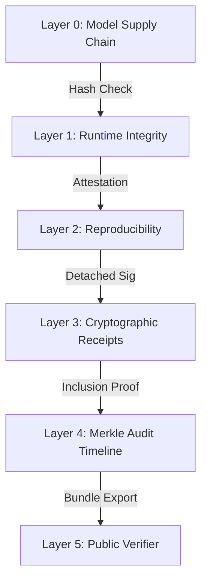

# Trust Chain: Verifiable AI Execution

The LLM Inference Stack implements a multi-layered trust chain to ensure the integrity, reproducibility, and auditability of every inference request.

## Layered Security Model

### 1. Model Supply Chain (Layer 0)
- **Objective**: Ensure the model running is exactly what was requested.
- **Mechanism**: SHA256 verification of model weights and manifest during loading.
- **Artifact**: Signed Model Manifest.

### 2. Runtime Integrity (Layer 1)
- **Objective**: Confirm the inference environment has not been tampered with.
- **Mechanism**: TPM-based attestations or cryptographic snapshots of the runtime state.
- **Artifact**: Environment Attestation Token.

### 3. Reproducibility (Layer 2)
- **Objective**: Guarantee that the same input always produces the same output (for a given seed/version).
- **Mechanism**: Deterministic sampling controls and version pinning.
- **Artifact**: Replay Manifest.

### 4. Cryptographic Receipts (Layer 3)
- **Objective**: Provide a signed proof of the inference result.
- **Mechanism**: RSA/Ed25519 signature of the (Input Hash + Output Hash + Metadata).
- **Artifact**: Detached Signature (`receipt_id`).

### 5. Merkle Audit Timeline (Layer 4)
- **Objective**: Prove the existence and order of receipts without exposing content.
- **Mechanism**: Aggregation of receipt hashes into time-sealed Merkle trees.
- **Artifact**: Merkle Root + Inclusion Proofs.

### 6. Public Verifier (Layer 5)
- **Objective**: Enable third-party verification of the entire chain.
- **Mechanism**: Standalone CLI tool to recompute and validate all layers offline.
- **Artifact**: Verification Report.

## Key Principles

1. **Content Privacy**: Original prompts and responses are NEVER stored in the Merkle tree or execution proofs. Only cryptographic hashes are used.
2. **Immutability**: Once a timeline window is sealed, it cannot be modified without invalidating the entire chain.
3. **Transparency**: Tenants can export their audit trail at any time for independent verification.

---

**Next Steps**: See [ENDPOINT_INDEX.md](ENDPOINT_INDEX.md) for API accessibility.
