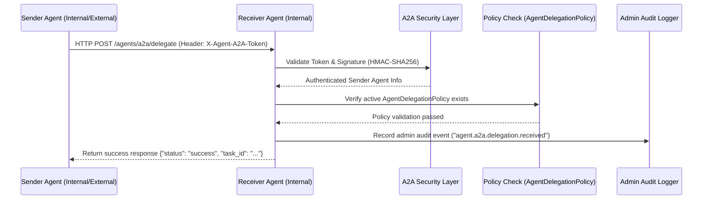

# Google A2A Interoperability Protocol

The Google A2A (Agent-to-Agent) protocol enables secure, standardized, and policy-governed communication and task delegation between internal agents and external compatible agents.

## Feature Flags

The A2A protocol capability is fully opt-in and controlled via the following flags:
*   `AGENT_A2A_ENABLED=false` (Default: disabled. Must be set to `true` to activate any A2A APIs or services).
*   `AGENT_A2A_EXTERNAL_ENABLED=false` (Default: disabled. Must be set to `true` to allow external agent registrations or outbound HTTP requests).

## Architecture & Data Flow



## Security & Verification

### Authentication
All message and delegation requests must supply the sender agent's registered authorization token inside the HTTP header:
```http
X-Agent-A2A-Token: <token>
```

### Signature Verification
To guarantee payload integrity, every request must include a cryptographic signature computed over the serialized payload.
1. Serialize the JSON body excluding the `"signature"` field with sorted keys.
2. Sign the serialized string using HMAC-SHA256 with the sender agent's registration `auth_token` as the secret key.
3. Compare the generated hex digest with the provided signature value.

## Agent Registration

### Internal Agents
Internal agents must already have an existing entry in the `agent_definitions` table. Registration maps them to the A2A protocol and generates their token and target endpoint.

### External Agents
When registering an external agent (with `is_external=true`), a placeholder entry is dynamically generated inside the `agent_definitions` table with `owner="external"`. This ensures the external agent's identity exists natively in the database, allowing policy maps to bind it securely.

## Policy Engine & Tenant Isolation

1. **Tenant Isolation**: Cross-tenant communication, registration, or task delegation is strictly blocked. An agent can only send messages to or delegate tasks to agents registered within the same tenant.
2. **Policy Enforcement**: External agents are prohibited from executing any action on internal agents unless an explicit `AgentDelegationPolicy` is active.
    * Table name: `agent_delegation_policies`
    * Fields checked: `source_agent_id` (delegator), `target_agent_id` (delegatee), `tenant_id`, and `is_active=True`.

## API Endpoints

### Admin APIs (Require Admin Token)
*   **List Registered Agents**
    *   `GET /admin/agents/a2a/agents`
    *   Query parameters: `tenant_id`
*   **Register Agent**
    *   `POST /admin/agents/a2a/register`
    *   Body:
        ```json
        {
          "tenant_id": "string",
          "agent_id": "uuid",
          "auth_token": "string",
          "target_url": "string (optional)",
          "capabilities": {"features": ["string"]},
          "is_external": false
        }
        ```

### Agent APIs (Require X-Agent-A2A-Token Header)
*   **Receive Message**
    *   `POST /agents/a2a/message`
    *   Request payload contains message meta and cryptographic signature.
*   **Receive Task Delegation**
    *   `POST /agents/a2a/delegate`
    *   Requires a valid `AgentDelegationPolicy` configuration.

## Audit Trails

All A2A interactions are recorded to the central `AdminAuditEvent` repository:
*   `agent.a2a.message.sent`
*   `agent.a2a.message.received`
*   `agent.a2a.delegation.sent`
*   `agent.a2a.delegation.received`
