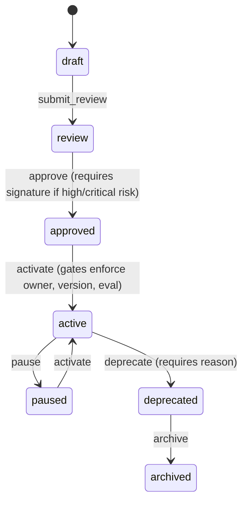

# Agent Lifecycle Governance

This system manages the promotion and deprecation lifecycle of agents, providing safety gates and an audit trail of all lifecycle events.

## Lifecycle States

Agents transition through the following states:

1.  `draft`: Initial state where instructions and configurations are modified.
2.  `review`: Undergoing administrative or compliance evaluation.
3.  `approved`: Certified safe for potential promotion.
4.  `active`: Promoted to production. Available for deployment and execution.
5.  `paused`: Temporarily disabled from production execution.
6.  `deprecated`: Marked obsolete. Replaced by a newer catalog entry.
7.  `archived`: Permanently stored for history/compliance, unavailable for running.

## Governance Gates & Promotion Rules

### 1. Verification Checklist for Production (`active`)
No agent is allowed to transition to `active` (production) unless it meets the following criteria:
*   **Owner Specified**: The agent must have a non-empty `owner` defined.
*   **Evaluation Baseline**: The agent must have a documented `eval_baseline` detailing validation results.
*   **Version History**: At least one version snapshot must exist.
*   **Approval Present**: High/critical risk agents must have been verified and signed off in `AgentPromotion` by a designated reviewer during approval.

### 2. Risk Validation
Agents flagged with `high` or `critical` risk levels must provide an `approved_by` signature to transition from `review` -> `approved`.

### 3. Surface Promotions
Experimental agents cannot have their surface status changed to `supported` (raises a ValueError exception).

### 4. Audit Trail
All transitions write a permanent log to the `agent_lifecycle_events` table, capturing `from_status`, `to_status`, `performed_by`, and audit notes.
