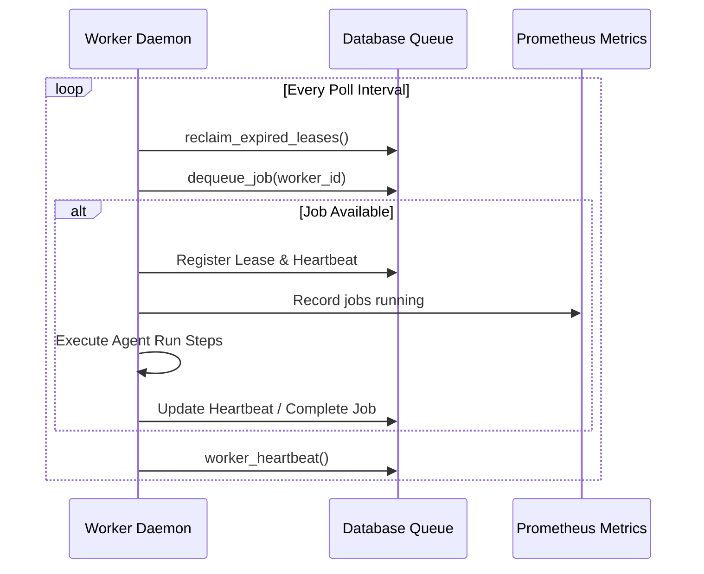

# Agent Background Workers

Agent Background Workers (`AgentWorkerService`) are dedicated processes responsible for pulling queued jobs from the queue, leasing them, and orchestrating their execution safely and reliably.

## Worker Lifecycle

## Lease Expiration and Recovery

To prevent jobs from getting stuck in a `leased` state if a worker crashes:
- Every active worker acquires a lease (`agent_execution_leases`) when dequeuing a job.
- The lease has a configurable timeout (default 60 seconds).
- Active workers update their heartbeat (`agent_worker_heartbeats`) periodically.
- If a worker dies, another worker executing its polling loop calls `reclaim_expired_leases()`, identifies the expired lease, removes the lease, and handles recovery:
  - If the job attempts are below `max_attempts` (default 3), the job is rescheduled with status `queued`.
  - If the job attempts reach `max_attempts`, it is moved to the DLQ (`agent_execution_dead_letters`) with status `dead_letter`.

## Exponential Backoff Retries

When a job fails due to worker crash/lease expiration or temporary transient errors, the system schedules a retry with exponential backoff:
$$\text{Delay} = \text{initial\_delay\_seconds} \times (\text{backoff\_factor}^{\text{attempts} - 1})$$
For example, with `initial_delay_seconds = 5` and `backoff_factor = 2.0`:
- **Attempt 1**: 5s delay
- **Attempt 2**: 10s delay
- **Attempt 3**: 20s delay

All retry attempts are logged in the `agent_execution_retries` table.

## Dead Letter Queue (DLQ)

When a job repeatedly fails and reaches `max_attempts`, it is transferred to the Dead Letter Queue:
- Status changes to `dead_letter`.
- An entry is created in `agent_execution_dead_letters` containing the job metadata, tenant ID, and the last error message.
- Runs in DLQ can be listed and retried by admin operators via `/admin/agents/execution/dead-letter` and `/admin/agents/execution/jobs/{id}/retry`.

## Audit Logging & Limits Enforcements

Workers record audit events in `agent_run_events` during execution. Moreover, execution is continuously checked against definition safety limits:
- **Max Steps**: Ensures the agent stops after executing a maximum number of steps.
- **Max Runtime Seconds**: Kills execution if it exceeds the specified maximum duration.
- **Max Tokens**: Halts execution if token usage exceeds safety thresholds.
- **Max Cost (BRL)**: Kills execution if total cost in BRL exceeds thresholds.
