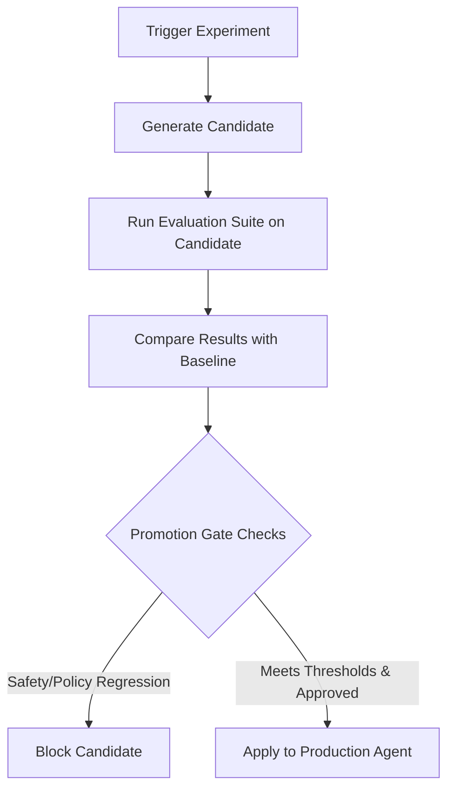

# Agentic CI/CD

This document details the Agentic CI/CD workflow implemented in the Agentic AI Platform, allowing automated validation, evaluation, and promotion of optimization candidates.

## CI/CD Workflow Overview

The Agentic CI/CD flow ensures that any changes to agent prompts, tool selection configurations, or policy engines undergo rigorous validation against baseline evaluations before they can be promoted to staging or production.



## Promotion Gate Rules

To guarantee safety and performance, the **Promotion Gate** enforces strict criteria before a candidate is allowed to be applied:

1. **Explicit Admin/User Approval**:
   - Promoted candidates must be approved via explicit actions.
   - Auto-apply is strictly disabled in production. An administrator must trigger `POST /admin/agents/{id}/optimization/candidates/{candidate_id}/apply` after reviewing and approving the optimization candidate.

2. **No Safety/Policy Regressions**:
   - A candidate is blocked from promotion if `safety_failure_delta > 0` or if the safety regression flag is set.
   - Any regression in security boundaries, token exposure, policy engine rules, or content filters blocks the promotion gate.

3. **Metrics Comparison**:
   - The evaluation compares candidate metrics against the current baseline.
   - If performance or compliance metrics drop below accepted thresholds, the pipeline flags the candidate as blocked.

## Command-Line Validation (CLI)

The Makefile includes a dedicated helper command to execute evaluations and verify safety/optimization constraints.

Run the local verification checks with:

```bash
make agent-optimization-check
```

This target runs:
```bash
PYTHONPATH=control_plane .venv/bin/pytest control_plane/tests/test_agent_optimization.py -v
```

## GitHub / GitLab CI Integration

To automate evaluations as part of pull requests, you can integrate the optimization check into your GitHub Actions workflow or GitLab CI pipeline.

### GitHub Actions Workflow Example

Create `.github/workflows/agent-cicd.yml`:

```yaml
name: Agentic CI/CD Verification

on:
  push:
    branches: [ main, release/* ]
  pull_request:
    branches: [ main ]

jobs:
  agent-validation:
    runs-on: ubuntu-latest
    steps:
      - uses: actions/checkout@v3

      - name: Set up Python
        uses: actions/setup-python@v4
        with:
          python-version: '3.12'

      - name: Install dependencies
        run: |
          python -m venv .venv
          .venv/bin/pip install -r control_plane/requirements.txt

      - name: Run Optimization Evals & Verification
        run: |
          make agent-optimization-check
```

### GitLab CI Example

Create `.gitlab-ci.yml`:

```yaml
stages:
  - test

agent-validation-job:
  stage: test
  image: python:3.12
  before_script:
    - python -m venv .venv
    - source .venv/bin/activate
    - pip install -r control_plane/requirements.txt
  script:
    - make agent-optimization-check
```
