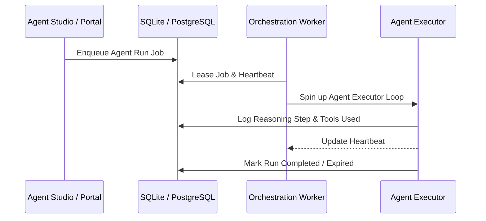

# Enterprise Agentic Platform Architecture

The `llm-inference-stack` provides a high-reliability, enterprise-grade runtime for executing AI agents. This document describes the runtime guarantees, multi-agent coordination, and underlying architecture patterns.

## Process and Task Execution Model

Agent tasks are processed asynchronously via a durable task queue governed by an **Orchestration Worker**:

### Heartbeats, Retries, and Leases
- **Lease Duration**: A worker leases a job for a configurable period (default 60 seconds).
- **Heartbeats**: Running executor loops periodically touch the lease in the DB. If a worker dies, another worker reclaims the lease after expiration.
- **Retries & DLQ**: Failed executor steps are retried. Repeated failures are sent to a Dead Letter Queue (DLQ) for human auditing.

## Multi-Agent Coordination

The platform supports multiple multi-agent styles, including:
1. **Debate Teams**: Multiple agents debate a topic with a moderator compiling the final consensus.
2. **Hierarchical Teams**: A supervisor agent delegating tasks to specialized sub-agents.
3. **Task-Engine Routing**: Standard pipeline/DAG execution mapping tool calls and human approvals.

## Data Isolation and Tenancy

Every entity, resource, and relation belongs to a specific `tenant_id`.
- Queries are strictly bound to a tenant.
- Cross-tenant queries are blocked at the engine layer (see `graph_policy.py`).
- Secrets and configurations are isolated per tenant workspace.
