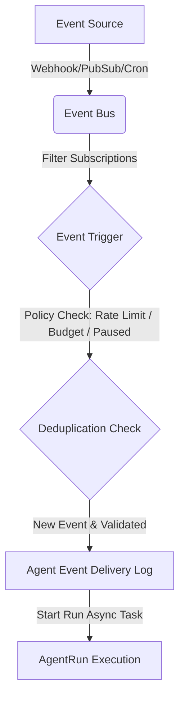

# Proactive and Event-Driven Agents

The LLM Inference Stack supports proactive execution of agents triggered by external and internal events. This enables agents to run autonomously in response to cron schedules, system metrics, database notifications, webhooks, or pub/sub messages.

## Feature Overview

The event-driven platform includes:
- **Governance**: Every trigger is bound to rate limits and budgets to prevent cascading executions (storms) or cost overruns.
- **Safety by Default**: All event-driven APIs, cron services, and webhook routes are completely guarded by feature flags. By default, all feature flags are disabled.
- **Deduplication**: Incoming events undergo automatic key generation and lookups to prevent processing duplicate payloads.
- **Data Privacy**: Event payloads are recursively scanned and redacted to ensure sensitive information (e.g. passwords, secrets, tokens) is never written to DB delivery logs or passed to execution contexts.

## Architecture



## Configuring Feature Flags

To enable event-driven agents, configure the following feature flags in your `.env` or `config/feature-flags.yaml`:

```ini
AGENT_EVENT_DRIVEN_ENABLED=true
AGENT_EVENT_HOOKS_ENABLED=true
AGENT_CRON_TRIGGERS_ENABLED=true
AGENT_PUBSUB_TRIGGERS_ENABLED=true
AGENT_EXTERNAL_WEBHOOK_TRIGGERS_ENABLED=true
```
