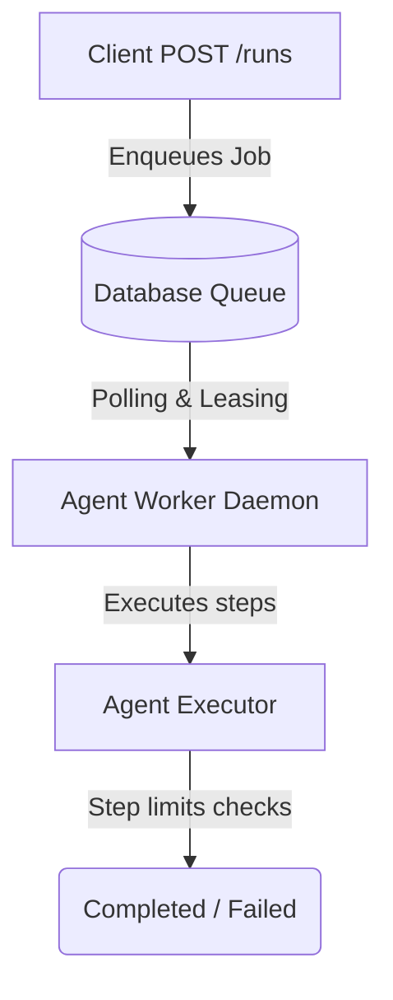

# Agent Execution Plane

The **Agent Execution Plane** is an asynchronous, isolated, and highly reliable execution environment designed to process agent runs outside the HTTP request lifecycle. By decoupling agent execution from incoming HTTP request handling, the system handles long-running, multi-step agent actions without risking timeouts or tying up web server resources.

## Architecture Overview

When an agent run is triggered asynchronously, the HTTP endpoint creates an agent run definition and immediately enqueues an execution job in the database. A pool of out-of-process background workers then consumes, leases, and executes these jobs.

## Feature Flags

The execution plane behaviour is controlled via the following feature flags defined in `feature-flags.yaml` and `app/core/config.py`:

- `AGENT_EXECUTION_PLANE_ENABLED` (Default: `false`): Master toggle for the entire execution plane. If `false`, no async execution or worker processes can run.
- `AGENT_WORKER_ENABLED` (Default: `false`): Enables the local worker background loop to pull and process jobs.
- `AGENT_ASYNC_EXECUTION_ENABLED` (Default: `false`): If `true`, calls to `POST /agents/{agent_id}/runs` enqueue jobs for worker processing instead of running synchronously in-process.
- `AGENT_QUEUE_BACKPRESSURE_ENABLED` (Default: `true`): Enables concurrency limits check (tenant, agent, global, risk level) prior to enqueuing jobs.

## Job State Machine

Every execution job (`AgentExecutionJob`) transitions through a series of robust states to guarantee reliability, observability, and recoverability:

1. **`queued`**: Job has been inserted into the queue and is waiting for an available worker.
2. **`leased`**: A worker has claimed the job and acquired a lease. No other worker can claim this job during the lease duration.
3. **`running`**: The worker is actively executing the agent steps.
4. **`waiting_approval`**: The job is suspended, awaiting human-in-the-loop approval.
5. **`completed`**: The agent execution has finished successfully.
6. **`failed`**: The job failed permanently or encountered an unrecoverable error.
7. **`cancelled`**: The job was explicitly cancelled by an operator or user.
8. **`dead_letter`**: The job failed repeatedly and exhausted its maximum attempt limit. It is moved to the Dead Letter Queue (DLQ) for operator intervention.

---

## Operations & Control

Operator endpoints are available under the `/admin/agents/execution/` prefix:

- **List Jobs**: `GET /admin/agents/execution/jobs`
- **Cancel Job**: `POST /admin/agents/execution/jobs/{id}/cancel`
- **Retry Job**: `POST /admin/agents/execution/jobs/{id}/retry`
- **List DLQ**: `GET /admin/agents/execution/dead-letter`
