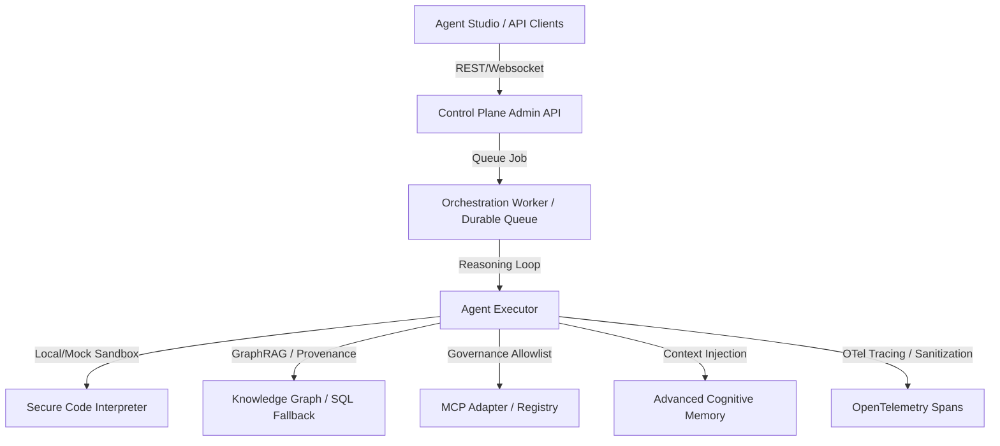

# AI Agentic Platform: Platform Overview

The Agentic AI Platform is an enterprise-grade runtime environment designed to run autonomous agents securely, reliably, and with strict compliance boundaries. It transforms the core inference stack into a fully orchestrated agent execution plane.

## High-Level Architecture

The platform architecture is structured around safety, tenant isolation, and visibility:

## Core Components

The platform consists of nine key components integrated into the `llm-inference-stack`:

1. **Secure Code Interpreter**: A sandboxed execution runtime supporting mock, Docker, and WASM providers with strict resource limits and syscall validation.
2. **Knowledge Graph & GraphRAG**: A rich entity-relationship store backed by SQLite/Neo4j that combines vector retrieval with sub-graph traversal under strict tenant boundaries.
3. **Model Context Protocol (MCP)**: A secure adaptation layer exposing internal resources and tools, while safely consuming external MCP servers.
4. **Advanced Cognitive Memory**: Integrated working, episodic, and semantic memory layers with automated summarization and consent controls.
5. **Agent Studio & Approval Portal**: A visual designer for flows/DAGs and a human-in-the-loop dashboard to review and approve high-risk actions.
6. **Internal Agent Marketplace**: A catalog of reusable, semantic-versioned agent templates and trust reports.
7. **Advanced Observability**: Fully-sanitized OpenTelemetry tracing mapping agent loops, steps, tool calls, and memory transactions.
8. **Auto-Optimization**: Evals-driven prompt and policy optimization operating strictly on an advisory basis.
9. **E2E Agentic Test Suite**: Automated verification for jailbreaks, sandbox escapes, graph performance, and multi-agent coordination.

## Getting Started

To explore the agentic runtime capabilities:
- Refer to [Enterprise Agentic Platform](file:///home/kleber/llm-inference-stack/docs/agents/enterprise-agentic-platform.md) for deeper architecture.
- Learn about the security posture in [Safe-by-Default Configuration](file:///home/kleber/llm-inference-stack/docs/agents/safe-by-default.md).
- Hardening deployment guidelines can be found in [Production Hardening Guide](file:///home/kleber/llm-inference-stack/docs/agents/production-hardening.md).
