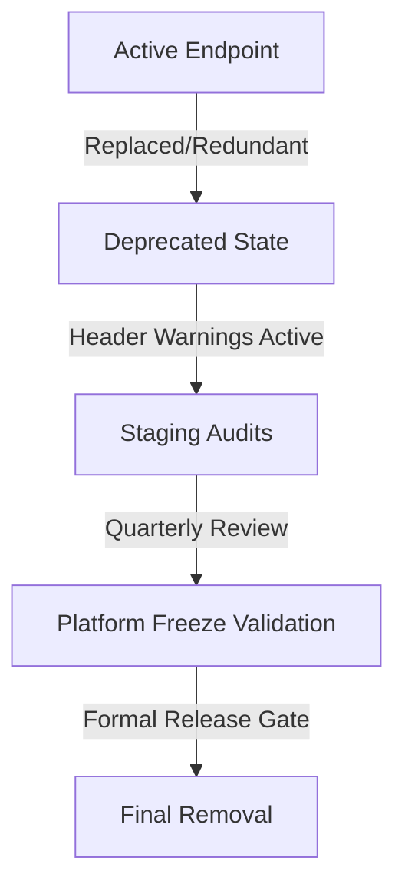

# API Deprecation Policy

This document defines the official API deprecation lifecycle and versioning policy for the `llm-inference-stack` platform.

## Deprecation Lifecycle

When an API endpoint is replaced or marked for cleanup, it undergoes a formal deprecation period:

1. **Identification**: A route is marked with `status: deprecated` in `config/api-surface.yaml`.
2. **Notification**: The middleware injects warnings (`X-Deprecated-Endpoint: true` and `X-Replacement-Endpoint` headers) into every client HTTP response.
3. **Grace Period**: Deprecated endpoints must be kept functional for at least one major release cycle or three months before being physically removed.

---

## Response Header Contract

Integrating clients must monitor HTTP responses for the following headers:

### `X-API-Surface-Status`
Returns the status classification of the endpoint.
- Value: `supported | deprecated | internal | experimental`

### `X-Deprecated-Endpoint`
Injected on deprecated endpoints.
- Value: `true`

### `X-Replacement-Endpoint`
Identifies the replacement path.
- Value: The absolute or relative path of the replacement route (e.g., `/admin/models/lifecycle`).
