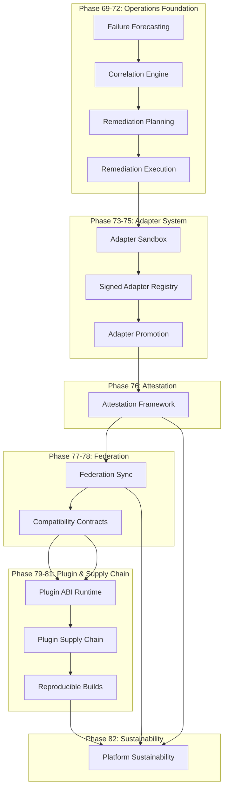

# Platform Module Relationships

## Module Dependency Graph

## Module Dependency Table

| Module | Depends On | Used By |
|--------|-----------|---------|
| Phase 69: Failure Forecasting | — | Phase 70 |
| Phase 70: Correlation Engine | Phase 69 | Phase 71 |
| Phase 71: Remediation Planning | Phase 70 | Phase 72 |
| Phase 72: Remediation Execution | Phase 71 | Phase 73, Phase 82 |
| Phase 73: Adapter Sandbox | Phase 72 | Phase 74 |
| Phase 74: Adapter Registry | Phase 73 | Phase 75 |
| Phase 75: Adapter Promotion | Phase 74 | Phase 76 |
| Phase 76: Attestation Framework | Phase 75 | Phase 77, Phase 82 |
| Phase 77: Federation Sync | Phase 76 | Phase 78, Phase 82 |
| Phase 78: Compatibility Contracts | Phase 77 | Phase 79 |
| Phase 79: Plugin ABI | Phase 78 | Phase 80 |
| Phase 80: Plugin Supply Chain | Phase 79 | Phase 81 |
| Phase 81: Reproducible Builds | Phase 80 | Phase 82 |
| Phase 82: Platform Sustainability | Phase 72, 76, 77, 81 | — |

## Cross-Cutting Concerns

### Deterministic Event Architecture
Spans all phases. Every phase produces deterministic events that feed into the correlation engine, attestation framework, and replay verification.

### Governance
The governance engine consumes events from all phases and produces policy decisions. Governance is advisory-first: all decisions are dry-run by default.

### Security & Trust
Security boundaries are defined across all phases but no phase implements real PKI, hardware-backed trust, or real plugin execution.

### Validation
Each phase includes its own validation scripts and tests. The aggregate validation targets (`validate-architecture-smoke`, `validate-architecture-full`) compose all phase validators in deterministic order.

## Key Architectural Invariants

1. No circular dependencies between bounded contexts
2. All phase validations run offline
3. No phase introduces mandatory SaaS dependencies
4. No phase implements real execution — only contracts and validation
5. All state changes produce immutable, versioned events
6. All cross-context communication uses explicit contracts
