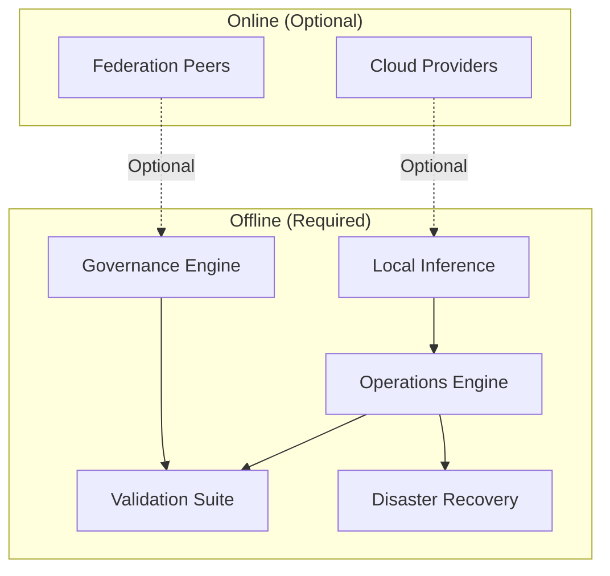
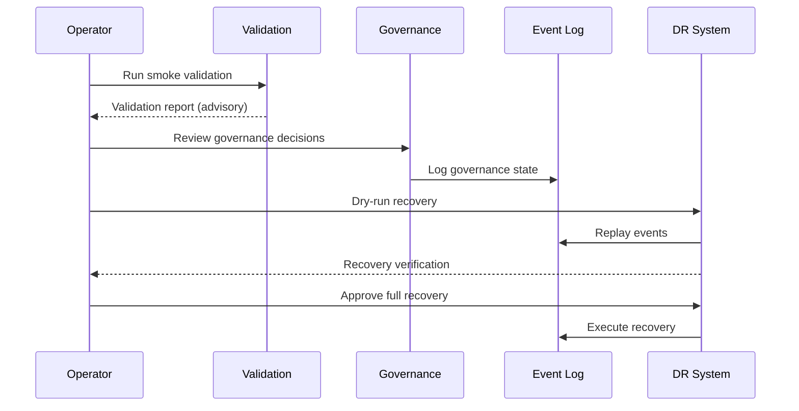

# Platform Operational Model

## Offline-First Operations

The platform is designed to operate fully offline. Every operational capability functions without internet connectivity:

## Operational Model Components

### Event Architecture
- Deterministic events are the central nervous system
- All state changes produce versioned, immutable events
- Events are replayable without side effects
- No external broker required (Kafka, Redis streams out of scope)

### Governance Model
- Policies are evaluated in advisory mode
- Operator approves or rejects governance decisions
- All decisions are logged with full provenance
- Default mode: dry-run

### Validation Model
- Smoke validation runs static checks (fast path)
- Full validation includes all tests (complete path)
- All validations run offline
- Results are advisory but deterministic

### Recovery Model
- Backup manifests are verified deterministically
- Replay verification ensures consistency
- Dry-run recovery validates without side effects
- Full recovery requires explicit operator approval

## Operational Flow

## Key Operational Properties

| Property | Behavior |
|----------|----------|
| Deterministic | Same inputs produce same outputs always |
| Replayable | Event logs reconstruct any past state |
| Offline | No mandatory network dependencies |
| Advisory | All validations are advisory by default |
| Auditable | Every action produces a verifiable receipt |
