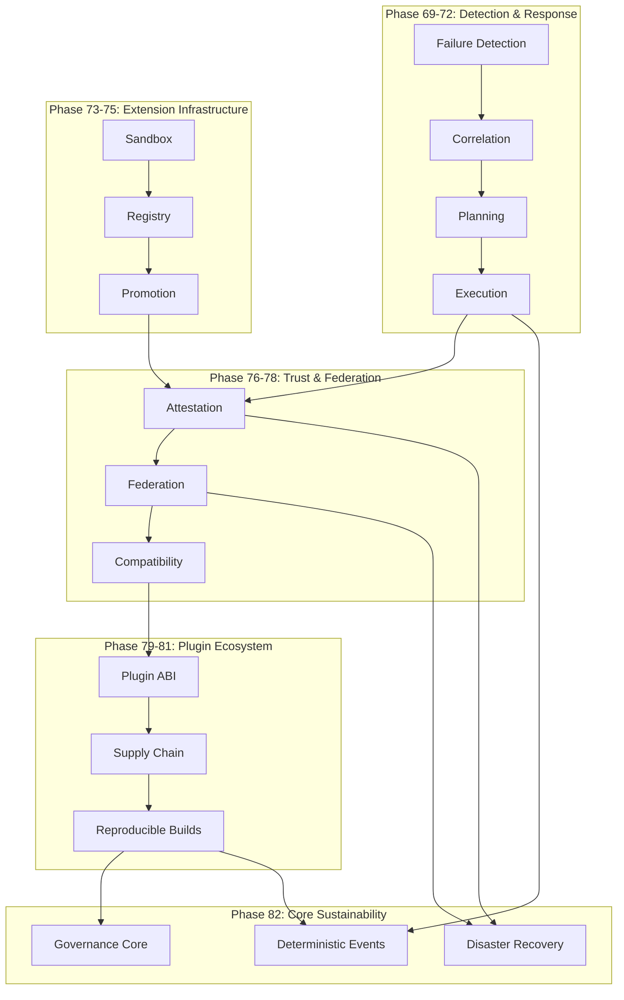

# Platform Phase Timeline — Phases 69–82

## Overview

The Phase 69–82 sequence represents the deterministic operations, extensibility, and sustainability track of the platform. Each phase builds on the previous, following strict dependency ordering.

## Phase Map

```mermaid
graph LR
    P69[Phase 69<br/>Failure Forecasting] --> P70[Phase 70<br/>Correlation Engine]
    P70 --> P71[Phase 71<br/>Remediation Planning]
    P71 --> P72[Phase 72<br/>Remediation Execution]
    P72 --> P73[Phase 73<br/>Adapter Sandbox]
    P73 --> P74[Phase 74<br/>Signed Registry]
    P74 --> P75[Phase 75<br/>Adapter Promotion]
    P75 --> P76[Phase 76<br/>Attestation Framework]
    P76 --> P77[Phase 77<br/>Federation Sync]
    P77 --> P78[Phase 78<br/>Compatibility Contracts]
    P78 --> P79[Phase 79<br/>Plugin ABI]
    P79 --> P80[Phase 80<br/>Plugin Supply Chain]
    P80 --> P81[Phase 81<br/>Reproducible Builds]
    P81 --> P82[Phase 82<br/>Platform Sustainability]
```

## Detailed Timeline

### Phase 69 — Predictive Failure Forecasting
- **Objective**: Implement deterministic failure signal models and forecasting engine
- **Outputs**: Failure signal models, risk scoring, forecasting receipts
- **Dependencies**: Phase 66 readiness gate
- **Validation**: `validate_phase_69_failure_forecasting.py`

### Phase 70 — Deterministic Correlation Engine
- **Objective**: Correlate operational events into a trust graph for root cause analysis
- **Outputs**: Correlation models, operational trust graph, correlation receipts
- **Dependencies**: Phase 69
- **Validation**: `validate_phase_70_correlation_engine.py`

### Phase 71 — Deterministic Remediation Planning
- **Objective**: Plan remediation actions with blast radius analysis and approval requirements
- **Outputs**: Remediation plans, blast radius analysis, approval chains
- **Dependencies**: Phase 70
- **Validation**: `validate_phase_71_remediation_planning.py`

### Phase 72 — Approval-Gated Remediation Execution
- **Objective**: Execute remediation plans through approval gates with rollback capability
- **Outputs**: Execution gates, simulation adapter, rollback receipts
- **Dependencies**: Phase 71
- **Validation**: `validate_phase_72_remediation_execution.py`

### Phase 73 — Controlled Adapter Sandbox
- **Objective**: Sandbox for adapter validation with contract verification and policy guard
- **Outputs**: Adapter contracts, manifest validator, sandbox context
- **Dependencies**: Phase 72
- **Validation**: `validate_phase_73_adapter_sandbox.py`

### Phase 74 — Signed Adapter Registry
- **Objective**: Registry for signed adapters with allowlist/blocklist and policy engine
- **Outputs**: Signed registry, hash utilities, allowlist/blocklist
- **Dependencies**: Phase 73
- **Validation**: `validate_phase_74_adapter_registry.py`

### Phase 75 — Adapter Promotion Workflow
- **Objective**: Formal promotion workflow from sandbox to production through gates
- **Outputs**: Promotion gates, staging simulation, promotion receipts
- **Dependencies**: Phase 74
- **Validation**: `validate_phase_75_adapter_promotion.py`

### Phase 76 — Sovereign Execution Attestation
- **Objective**: Framework for attesting execution without hardware root of trust
- **Outputs**: Attestation service, trust policy engine, replay verifier
- **Dependencies**: Phase 75
- **Validation**: `validate_phase_76_attestation_framework.py`

### Phase 77 — Sovereign Federation Synchronization
- **Objective**: Protocol for offline-first federation sync between sovereign instances
- **Outputs**: Environment registry, sync protocol, trust negotiation, conflict resolution
- **Dependencies**: Phase 76
- **Validation**: `validate_phase_77_federation_sync.py`

### Phase 78 — Compatibility Contracts & Version Negotiation
- **Objective**: Formal compatibility contracts with semantic versioning and capability negotiation
- **Outputs**: Compatibility matrix, version negotiation, deprecation lifecycle
- **Dependencies**: Phase 77
- **Validation**: `validate_phase_78_compatibility_contracts.py`

### Phase 79 — Formal Plugin ABI & Extension Runtime
- **Objective**: Plugin ABI contracts with capability boundaries and isolation policy
- **Outputs**: Plugin ABI, extension loader, isolation policy, replay verifier
- **Dependencies**: Phase 78
- **Validation**: `validate_phase_79_plugin_runtime.py`

### Phase 80 — Plugin Supply-Chain Provenance & SBOM
- **Objective**: Plugin supply chain framework with provenance and SBOM placeholders
- **Outputs**: Supply chain services, SBOM framework, provenance receipts
- **Dependencies**: Phase 79
- **Validation**: `validate_phase_80_plugin_supply_chain.py`

### Phase 81 — Reproducible Build & Artifact Verification
- **Objective**: Framework for reproducible builds and artifact verification
- **Outputs**: Build service, artifact verification, source lineage, replay verifier
- **Dependencies**: Phase 80
- **Validation**: `validate_phase_81_reproducible_builds.py`

### Phase 82 — Platform Sustainability & Governance Core
- **Objective**: Sustainable platform core with governance engine, deterministic events, and dry-run recovery
- **Outputs**: Governance core, policy engine, deterministic events, disaster recovery, sovereign observability
- **Dependencies**: Phase 72, Phase 76, Phase 77, Phase 81
- **Validation**: `validate_phase_82_platform_sustainability.py`

## Architectural Evolution

## Dependency Summary

| Phase | Builds On | Enables |
|-------|-----------|---------|
| 69 | Phase 66 | 70 |
| 70 | 69 | 71 |
| 71 | 70 | 72 |
| 72 | 71 | 73, 82 |
| 73 | 72 | 74 |
| 74 | 73 | 75 |
| 75 | 74 | 76 |
| 76 | 75 | 77, 82 |
| 77 | 76 | 78, 82 |
| 78 | 77 | 79 |
| 79 | 78 | 80 |
| 80 | 79 | 81 |
| 81 | 80 | 82 |
| 82 | 72, 76, 77, 81 | — |
