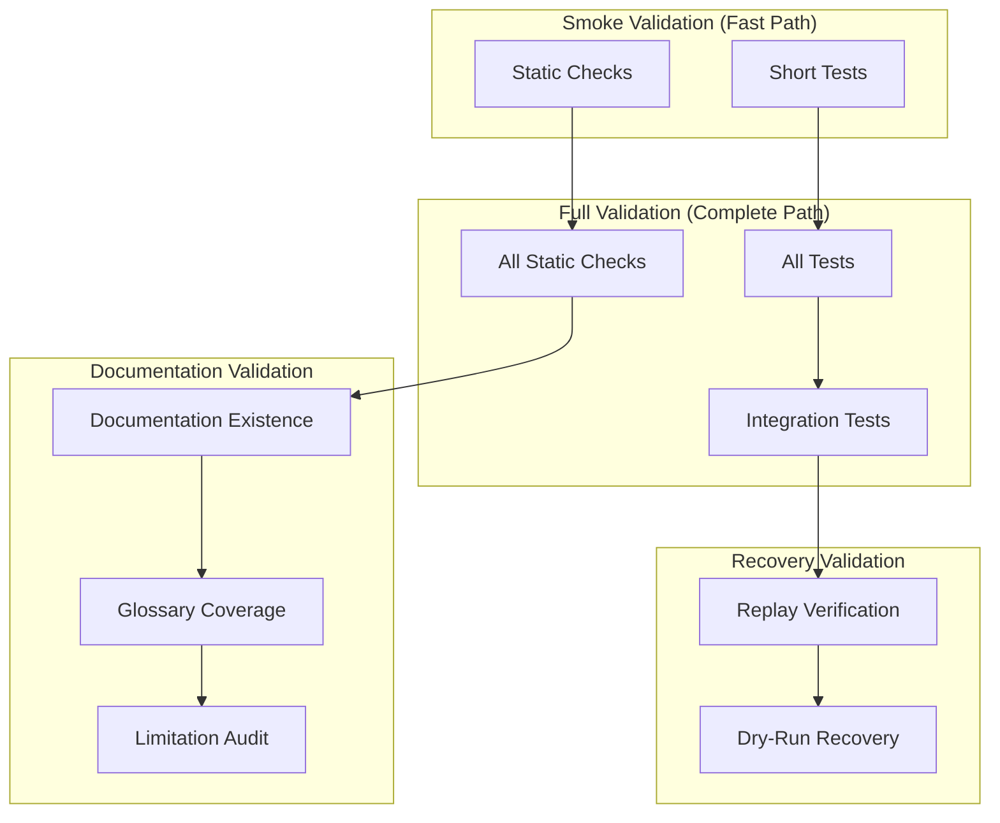

# Platform Validation Workflows

## Validation Architecture



## Workflow: Smoke Validation

```bash
make validate-architecture-smoke
```

1. Validates Makefile governance structure
2. Validates governance documentation foundation
3. Validates domain contracts
4. Validates prohibited claims
5. Validates platform architecture
6. Validates architecture boundaries
7. Validates runtime contracts
8. Validates invariants
9. Validates ADRs
10. Runs Phase 69–82 validator scripts (smoke mode)

## Workflow: Full Validation

```bash
make validate-architecture-full
```

Runs everything from smoke plus:

1. Phase 66 readiness gate
2. Phase 69 failure forecasting (full)
3. Phase 70 correlation engine (full)
4. Phase 71 remediation planning (full)
5. Phase 72 remediation execution (full)
6. Phase 73 adapter sandbox (full)
7. Phase 74 adapter registry (full)
8. Phase 75 adapter promotion (full)
9. Phase 76 attestation framework (full)
10. Phase 77 federation sync (full)
11. Phase 78 compatibility contracts (full)
12. Phase 79 plugin runtime (full)
13. Phase 80 plugin supply chain (full)
14. Phase 81 reproducible builds (full)
15. Phase 82 platform sustainability (full)

## Workflow: Documentation Validation

```bash
make validate-platform-documentation
```

1. Validates all required documentation files exist
2. Validates README structure and required sections
3. Validates docs/index.md exists and is complete
4. Validates glossary contains required terms
5. Validates phase timeline covers Phases 69–82
6. Validates explicit limitations are present
7. Runs pytest test suite against documentation
8. Validates absence of prohibited claims

## Workflow: Recovery Validation

```bash
make validate-architecture-full
```

Includes disaster recovery verification as part of Phase 82:

1. Replay verification of deterministic event logs
2. Dry-run recovery validation
3. Backup manifest integrity
4. Sovereign disaster recovery readiness

## Validation Results Interpretation

### Smoke Validation
- Fast feedback (seconds)
- Catches structural issues, missing files, prohibited claims
- Suitable for CI pre-merge and daily development

### Full Validation
- Complete coverage (minutes)
- Includes all phase validators and tests
- Suitable for release gates and audit

### Documentation Validation
- Ensures documentation is consistent and complete
- Validates internal links and required content
- Ensures limitations are explicit and prohibitions are respected

### Recovery Validation
- Ensures replay safety and recovery readiness
- Validates dry-run recovery without side effects
- Confirms offline-first capability
