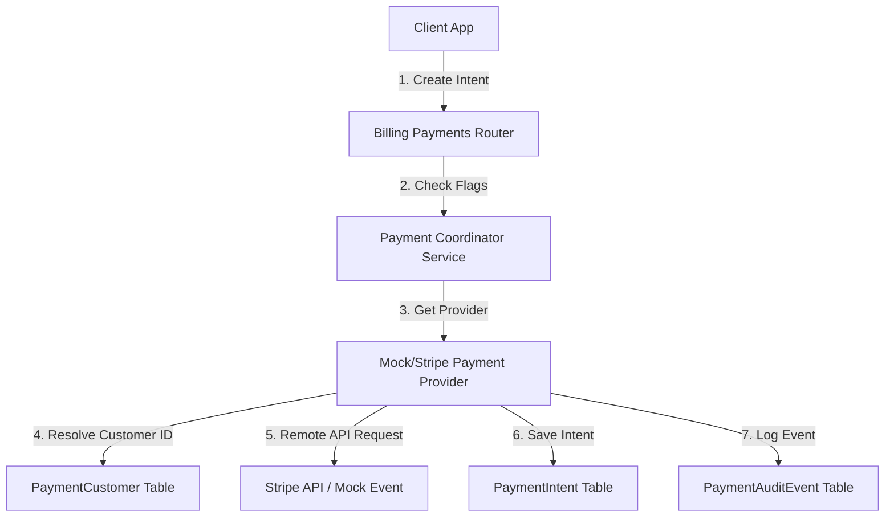

# Real and Governed Payment Processing

Secure, real-time payment processing for the platform with Stripe integration while keeping mock/offline processing as the default.

## Feature Flags

Payment processing behavior is controlled by these configuration keys:
*   `PAYMENT_PROCESSING_ENABLED=false` (Default: disabled/opt-in).
*   `PAYMENT_PROVIDER=mock` (Accepts `mock` or `stripe`. Default: `mock`).
*   `STRIPE_PAYMENT_ENABLED=false` (Must be set to `true` to allow Stripe client/customer/intent requests).
*   `STRIPE_SECRET_KEY=""` (Secret Stripe API key).
*   `STRIPE_WEBHOOK_SECRET=""` (Stripe Webhook signing secret used to verify webhook signatures).

## Architecture & Integration



## Security & Card Data Policies

1.  **No Card/Token Logging**: To remain fully PCI-DSS compliant, raw credit card details, payment tokens, CVVs, and `client_secret` variables are strictly excluded from all application logs and database audit entries.
2.  **Audit Event Repository**: Key transactions are logged to `payment_audit_events` with sanitized metadata:
    *   `payment.intent_created`
    *   `payment.reconciled`
    *   `payment.succeeded`
    *   `payment.failed`

## Webhook Signature Verification & Idempotency

### Signature Verification
Stripe Webhook requests at `/billing/webhooks/stripe` must supply the header `Stripe-Signature`. The webhook verification middleware constructs the event using:
```python
stripe.Webhook.construct_event(payload, signature_header, settings.stripe_webhook_secret)
```
Failure to verify signature rejects the request with `400 Bad Request`.

### Event Idempotency
Duplicate Stripe webhook events are handled gracefully. Webhook event details are persisted to the `payment_processing_webhook_events` table under `provider_event_id`. Before processing any event, the system checks if the event already exists. If it does, processing is skipped with an `idempotent_skip` status to prevent double-charging or duplicate status modifications.

## API Endpoints

### Admin APIs (Require Admin Token)
*   **Create Payment Intent**
    *   `POST /admin/billing/payments/create-intent`
    *   Body:
        ```json
        {
          "client_id": "uuid",
          "amount_cents": 1500,
          "currency": "brl",
          "invoice_id": "uuid (optional)",
          "idempotency_key": "string (optional)"
        }
        ```
*   **Get & Reconcile Payment Intent**
    *   `GET /admin/billing/payments/{id}`
    *   Fetches details from the database and retrieves the latest status from the provider to reconcile with linked invoices.

### Webhook API (Public)
*   **Stripe Webhook Receiver**
    *   `POST /billing/webhooks/stripe`
    *   Handles Stripe events like `payment_intent.succeeded` and `payment_intent.payment_failed` and reconciles billing statuses.
