# Fluxo Visual da Demonstração

## Fluxo Recomendado (30 min)

```mermaid
graph LR
    A[Landing Page] --> B[Capabilities]
    B --> C[Admin Dashboard]
    C --> D[Admin Lab]
    D --> E[Client Portal]
    E --> F[API Examples]
    F --> G[RAG Demo]
    G --> H[TTS Demo]
    H --> I[Sales/Leads]
    I --> J[Pricing/Plans]
    J --> K[Security Report]
    K --> L[Production Readiness]
    L --> M[Meeting Ready]
    M --> N[Proposal/Quote/SOW]
```

## Sequência Detalhada

### 1. Abertura — Landing Page
- **URL:** `http://localhost:18080/`
- **Duração:** 1 min
- **Objetivo:** Apresentar o produto e proposta de valor

### 2. Capacidades — /capabilities
- **URL:** `http://localhost:18080/capabilities`
- **Duração:** 2 min
- **Objetivo:** Mostrar transparência sobre recursos e limitações

### 3. Admin Dashboard
- **URL:** `http://localhost:18080/admin-dashboard`
- **Duração:** 4 min
- **Objetivo:** Demonstrar monitoria on-premise, saúde dos serviços

### 4. Admin Lab
- **URL:** `http://localhost:18080/admin-lab`
- **Duração:** 4 min
- **Objetivo:** Gestão de modelos, faturas, backends

### 5. Client Portal
- **URL:** `http://localhost:18080/client-portal`
- **Duração:** 3 min
- **Objetivo:** Autoatendimento do cliente, API keys, faturas

### 6. API OpenAI-compatible
- **URL:** `http://localhost:18080/v1/chat/completions`
- **Duração:** 3 min
- **Objetivo:** Demonstrar compatibilidade com ecossistema OpenAI

### 7. RAG Demo
- **URL:** `POST http://localhost:18080/v1/rag/query`
- **Duração:** 3 min
- **Objetivo:** Mostrar busca em documentos internos

### 8. TTS Demo
- **URL:** `POST http://localhost:18080/pocket-tts/tts`
- **Duração:** 2 min
- **Objetivo:** Geração de áudio local

### 9. Sales/Leads
- **URL:** `http://localhost:18080/admin-dashboard#sales`
- **Duração:** 2 min
- **Objetivo:** Pipeline de vendas integrado

### 10. Pricing/Plans
- **URL:** `http://localhost:18080/pricing`
- **Duração:** 2 min
- **Objetivo:** Planos e preços

### 11. Security Report
- **Comando:** `./scripts/security-report-local.sh`
- **Duração:** 2 min
- **Objetivo:** Relatório de segurança automatizado

### 12. Production Readiness
- **Comando:** `./scripts/production-readiness-local.sh`
- **Duração:** 2 min
- **Objetivo:** Verificação de prontidão para produção

### 13. Meeting Ready
- **Comando:** `make meeting-ready`
- **Duração:** 1 min
- **Objetivo:** Checklist pré-reunião

### 14. Proposal/Quote/SOW
- **Comando:** `make generate-proposal COMPANY_NAME="Cliente Demo"`
- **Duração:** 2 min
- **Objetivo:** Geração de proposta comercial

## Notas

- Dados exibidos são **fictícios** para demonstração
- Billing é **manual** — sem PSP/PIX real
- Screenshots devem ser capturados após `make demo-pack` e `make up`
