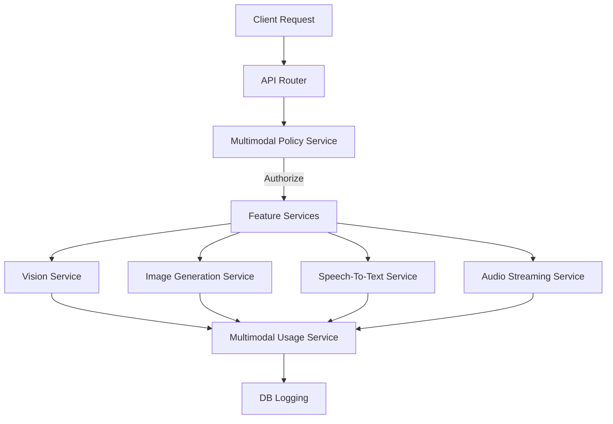

# Multimodal Governance Overview

This document describes the architecture, components, policy governance, and configuration of the multimodal support in the `llm-inference-stack` platform.

## Architecture

The multimodal support consists of four major capabilities (vision, image generation, speech-to-text, and audio streaming) governed by a policy engine and tracked by a usage manager for billing, tenant isolation, and audit logging.

## Feature Flags

Feature flags are configured in `config/feature-flags.yaml` and control opt-in behavior:

* `MULTIMODAL_ENABLED` (default: false): Global toggle for multimodal capabilities.
* `VISION_INPUT_ENABLED` (default: false): Controls access to the vision understanding endpoints.
* `IMAGE_GENERATION_ENABLED` (default: false): Controls access to the image generation endpoints.
* `SPEECH_TO_TEXT_ENABLED` (default: false): Controls access to speech transcription.
* `REALTIME_AUDIO_ENABLED` (default: false): Controls access to real-time audio streams.

## Core Services

All service logic resides in `control_plane/app/services/multimodal/`:

1. **Vision Service (`vision_service.py`)**: Handles visual understanding, secure URL restriction, and EXIF sanitization.
2. **Image Generation Service (`image_generation_service.py`)**: Mock and external image provider support.
3. **Speech-to-Text Service (`speech_to_text_service.py`)**: Audio transcription with conditional file storage.
4. **Audio Streaming Service (`audio_streaming_service.py`)**: Real-time wave streaming capability.
5. **Multimodal Policy (`multimodal_policy.py`)**: Tenant isolation, budget limits, and content safety checks.
6. **Multimodal Usage (`multimodal_usage.py`)**: Usage tracking and cost calculations.

## Database Schema

Four new tables are introduced:

* `multimodal_assets`: Stores sanitized assets (images/audios) with provenance, hashes, and sizes.
* `multimodal_requests`: Logs overall multimodal invocations.
* `multimodal_usage_events`: Tracks estimated billing units and costs.
* `multimodal_policy_events`: Records policy violations (content safety blocks, quota excesses).
