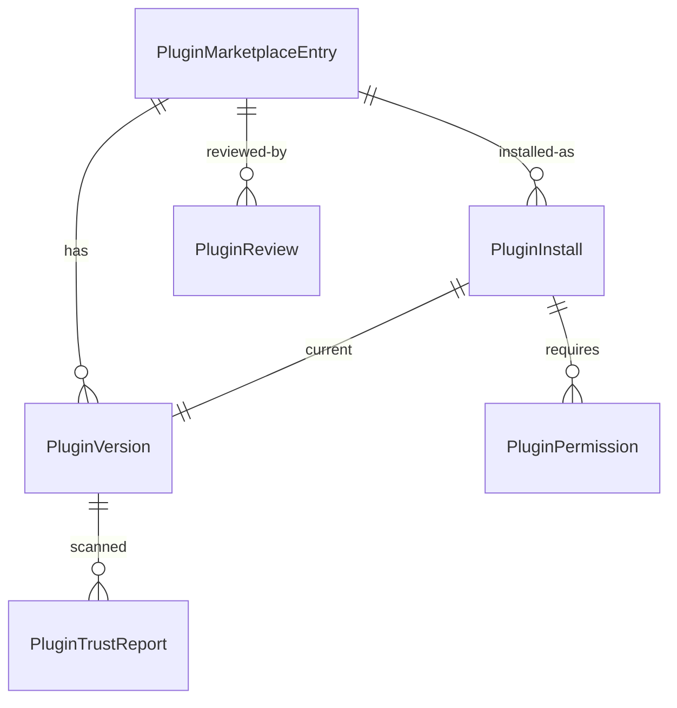

# Plugin Marketplace

## Architecture

The marketplace is an **optional, offline-first** plugin registry. It works entirely without internet connectivity. A remote catalog can be added as a read-through cache.

```
Admin UI ──→ PluginMarketplaceService ──→ Database (SQLite / PostgreSQL)
                  │
                  ├─ Local filesystem (data/plugins/<name>/<version>/)
                  ├─ PKIService (signature verification)
                  └─ SecurityEvent (audit trail)
```

## Offline Mode (Default)

No external dependencies. Plugins are distributed as `.zip` or `.tar.gz` files uploaded via the admin API. All verification (checksum, signature, permissions) happens locally.

## Remote Catalog (Optional)

The `list_marketplace()` method can be extended to query a remote registry endpoint. When enabled:

1. Remote catalog is fetched and cached locally.
2. Plugin downloads are proxied through the remote URL.
3. Verification still happens locally — the remote source is untrusted.

## Admin API Endpoints

| Method | Path | Description |
|---|---|---|
| `GET` | `/admin/plugins/marketplace` | List all known plugin entries |
| `POST` | `/admin/plugins/install` | Upload and install a plugin archive |
| `POST` | `/admin/plugins/{id}/enable` | Enable a plugin |
| `POST` | `/admin/plugins/{id}/disable` | Disable a plugin |
| `POST` | `/admin/plugins/{id}/upgrade` | Upgrade to a new version |
| `DELETE` | `/admin/plugins/{id}` | Uninstall a plugin |
| `GET` | `/admin/plugins/{id}/trust-report` | Get trust report for current version |
| `GET` | `/admin/plugins/{id}/versions` | List versions of a plugin entry |
| `GET` | `/admin/plugins/installs` | List all installed plugins |
| `POST` | `/admin/plugins/{id}/reviews` | Add a review/rating |
| `GET` | `/admin/plugins/{id}/reviews` | List reviews for a plugin |

## Installation Flow

1. Admin uploads `.zip` / `.tar.gz` via `POST /admin/plugins/install`
2. `PluginMarketplaceService` extracts `manifest.json`
3. Manifest v1 schema is validated
4. Archive checksum is verified (if provided)
5. Plugin name is checked against deny/allow lists
6. Signature is verified (if `PLUGIN_SIGNATURE_REQUIRED=true`)
7. `PluginMarketplaceEntry` is created/updated
8. `PluginVersion` is created
9. Plugin archive is saved to `data/plugins/<name>/<version>/`
10. `PluginInstall` is created (default: disabled)
11. Permissions are registered (all `granted=false`)
12. Legacy `PluginRegistry` is synced
13. `SecurityEvent` is logged

## Data Model



## Related

- [Manifest v1](manifest-v1.md)
- [Security Model](security-model.md)
- `app/services/plugins/plugin_marketplace.py`
- `app/models/plugins/marketplace.py`
- `app/api/plugin_marketplace_admin.py`
