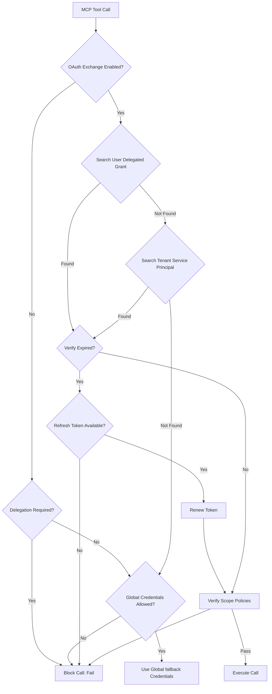

# Security Model: Agent Delegated Identity

This document defines the security boundaries, feature flags, and token life cycle of the Agent Delegated Identity system.

## Policy Resolution Flow

For every call to an external MCP server, the stack determines the identity using the following resolution chain:

## Configuration Flags

The behavior of the resolver is controlled by the following environment variables (feature flags):

| Environment Variable | Default | Description |
|---|---|---|
| `AGENT_MCP_OAUTH_TOKEN_EXCHANGE_ENABLED` | `false` | Enables checking delegated user/tenant grants. |
| `AGENT_MCP_USER_DELEGATION_REQUIRED` | `false` | If true, blocks execution if no specific user/tenant grant is found. |
| `AGENT_MCP_GLOBAL_CREDENTIALS_ALLOWED` | `false` | Permits falling back to system-wide stack credentials if no grant exists. |

## Threat Mitigation & Security Hardening

### 1. Token Leakage Prevention
Raw tokens are masked or omitted in all operations:
* Database schemas store `access_token` and `refresh_token` but they are redacted (`[REDACTED]`) before being returned in API responses.
* The audit trails (`MCPOAuthAuditLog` and system logs) only record sha256 hashes of token identifiers, user IDs, and tenant IDs.

### 2. Multi-Tenant Separation
The database query filters for grants and OAuth clients are hard-coded to require matching `tenant_id` parameters. Any request attempting to perform operations across tenants raises an immediate `PermissionError`.

### 3. Scope Policies
Policies dictate which tools or actions require specific scopes. Insufficient scopes immediately block the call and raise a `PermissionError`.
If a grant is revoked via `/admin/agents/mcp/oauth/grants/{id}`, subsequent calls will fail validation.
